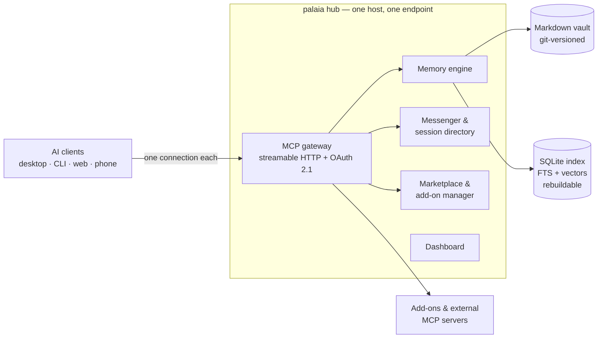

<!-- graphic: hero — logo/wordmark + tagline banner, light + dark variant, SVG preferred (issue #298 item 1). Drops in directly above the <h1>; the text below must keep working without it. -->

<div align="center">

# palaia

**One self-hosted hub. Every AI tool you use shares one memory, one toolbox, and one way to talk to each other.**

[](LICENSE)
[](v3/CHANGELOG.md)
[](https://github.com/byte5ai/palaia/actions/workflows/v3-ci.yml)
[](v3/deploy/README.md)

[Quickstart](#quickstart-60-seconds) · [What you get](#what-you-get) · [Architecture](#architecture) · [Docs](v3/site/docs/src/content/docs/) · [Migrating from v2](v3/docs/migrate-from-v2.md) · [Security](v3/SECURITY.md)

</div>

> [!IMPORTANT]
> **palaia v3 is a release candidate (`3.0.0-rc1`), not a final release.**
> Everything described below is implemented and covered by tests, but `3.0.0` is not
> tagged yet — an external security review and a real non-developer usability run
> still stand between here and the tag
> ([`v3/RELEASING.md`](v3/RELEASING.md) is the ordered list). Run it, break it, tell
> us. Keep backups. **palaia v2 remains the stable, supported product** until v3 is
> tagged — see [palaia v2](#palaia-v2-maintenance-mode).

---

## Why palaia exists

If you use more than one AI tool, you are living in an N × M problem.

Every MCP server has to be configured in every client — a different config file, a
different syntax, its own credentials, its own update cycle. And nothing any of them
learns ever reaches the others: tell one assistant a decision on Monday, and another
has never heard of it on Tuesday. Your accumulated context is scattered across
vendors, and mostly lost.

palaia collapses N × M into **N + M**. Each client connects **once** to your hub.
Each tool is installed **once** in your hub. What one agent learns, every agent
knows. It runs on your own hardware, and your memory is a folder of plain Markdown
files you can open, read, grep, and back up like any other document — no account to
be locked out of, no vendor that has to stay in business.

Think Home Assistant, for your AI stack.

<!-- graphic: 30-second demo — animated GIF or short capture: install one-liner → wizard → first memory saved from one client → recalled from a second client (issue #298 item 2). Goes here, above the Quickstart. -->

## Quickstart (60 seconds)

You need Docker ([Docker Desktop](https://www.docker.com/products/docker-desktop/) on
macOS/Windows, Docker Engine on Linux). That is the whole prerequisite list.

```bash
docker run -d --name palaia-hub \
  -p 8420:8420 \
  -v palaia_home:/data \
  --restart unless-stopped \
  --security-opt no-new-privileges:true --cap-drop ALL \
  --read-only --tmpfs /tmp --tmpfs /run \
  ghcr.io/byte5ai/palaia-hub:stable
```

Until `3.0.0` is tagged there is no `stable` image yet — swap the last line for
`ghcr.io/byte5ai/palaia-hub:edge`, which is built from `main` on every change. The
three [release channels](v3/deploy/README.md#updates-spec-501) are `stable`, `beta`
and `edge`; `palaia-hub update --channel <name>` switches a Compose install between
them.

Then open **`http://palaia.local`** in a browser on the same network. If that name
does not resolve — Docker's bridge network doesn't forward mDNS, and Docker Desktop
never will — use the address the container prints on startup (`docker logs
palaia-hub`), which always works: `http://<host>:8420`. Both paths are documented in
[`v3/deploy/README.md`](v3/deploy/README.md#mdns-httppalaialocal).

From there a setup wizard takes over in the browser: sign in, choose how far your hub
should reach, create your first memory, connect your first AI tool. No config files,
no second command. See
[Your first shared memory](v3/site/docs/src/content/docs/first-shared-memory.md) for
what that looks like end to end.

**Other ways to install:**

| Your machine | How |
|---|---|
| A file you keep, or Portainer-style setups | [`docker-compose.yml`](v3/deploy/docker-compose.yml) — `cd v3/deploy && docker compose up -d` |
| A script that checks Docker first, then prints the address | [`install.sh`](v3/deploy/install.sh) — `curl -fsSL https://raw.githubusercontent.com/byte5ai/palaia/main/v3/deploy/install.sh \| bash` |
| Umbrel, CasaOS, Runtipi, TrueNAS SCALE | Packages built and kept current in [`v3/deploy/stores/`](v3/deploy/stores/) — not listed in the official catalogs yet, so install the same image with Docker or Compose for now |
| Synology NAS | Container Manager runs the compose file as a "project", no terminal — [step-by-step guide](v3/site/docs/src/content/docs/install-synology.md) |
| Raspberry Pi | Works today on 64-bit Raspberry Pi OS with Docker, same one-liner. A flash-and-boot card image is in progress: [`v3/deploy/pi-image/`](v3/deploy/pi-image/) |
| A rented server (Hetzner, DigitalOcean, AWS, …) | Paste [`cloud-init.yaml`](v3/deploy/cloud-init.yaml) into the provider's user-data field — it installs Docker, joins your private network, and never exposes the hub to the open internet |

The full onboarding page (with copy buttons and the platform picker) lives at
[`v3/site/docs/src/pages/onboarding.astro`](v3/site/docs/src/pages/onboarding.astro);
the docs site is not publicly hosted yet, so this repository is the source of truth.

## Pick your path

| You are… | Start here |
|---|---|
| **New to palaia** | The [Quickstart](#quickstart-60-seconds) above, then [What is palaia?](v3/site/docs/src/content/docs/index.md) and [Your first shared memory](v3/site/docs/src/content/docs/first-shared-memory.md). Then connect the tools you actually use: [connect guides, one per client](v3/site/docs/src/content/docs/connect/clients/). |
| **An engineer who wants the design** | [Architecture](#architecture) below, then [`v3/MASTERPLAN.md`](v3/MASTERPLAN.md) (vision, pillars, full system design), the [ADRs](v3/decisions/), the [executable SPECs](v3/specs/), and [`v3/README.md`](v3/README.md) for dev setup and the test/lint commands. |
| **Already running palaia** | [Updating, backing up, migrating](#already-running-palaia) — including the [v2 → v3 migration guide](v3/docs/migrate-from-v2.md) and where to get [help](#community--support). |

## What you get

Grouped by what it does for you, not by what module it lives in. Every item below
ships in `3.0.0-rc1` — the full list is in [`v3/CHANGELOG.md`](v3/CHANGELOG.md).

### Memory that outlives the session

- **A vault of plain Markdown files you own** — one note per thing, YAML frontmatter,
  wikilinks and backlinks. Obsidian opens it as-is. The format is
  [formally specified](v3/docs/vault-format.md) and pinned by a conformance suite.
- **Every change is a real git commit**, written by the hub with a meaningful message
  (which agent, which client, why). `git log` is your audit trail; `git revert` is
  your undo.
- **Search that finds meaning, not just strings** — full-text and hybrid text+vector
  recall, with graph traversal ("continue where we left off") and token-budget-aware
  context assembly. Optional local embeddings; without them, search degrades cleanly
  to text-only rather than breaking.
- **An inbox and a curator.** Agents drop what they learn mid-work without deciding
  where it belongs; an asynchronous curator files, merges and de-duplicates it.
  Adding knowledge is autonomous — rewriting or retiring existing notes only ever
  becomes a proposal you approve.
- **Skills that teach your tools to save and look things up on their own**, so you
  stop having to ask every time.

### Connect every AI tool, once

- **One MCP endpoint** for Claude Code, Claude Desktop, claude.ai, ChatGPT, Codex,
  Gemini/Antigravity CLI, Grok, LM Studio — and anything else that speaks MCP. Each
  has its [own connect guide](v3/site/docs/src/content/docs/connect/clients/).
- **A one-click desktop bundle (MCPB)** — download, click, connected. No address to
  type, no token to paste.
- **Real auth, not a shared secret:** sign in with GitHub, Google or any OIDC
  provider, plus a full OAuth 2.1 authorization server (dynamic client registration,
  PKCE, token rotation) — and per-client tokens for tools that don't do OAuth.
- **Per-client tool profiles.** Give your phone's assistant a narrow tool set and
  your desktop everything, from one place, with zero client-side config. Each profile
  is its own endpoint URL.
- **Three access modes — Locked, Cloud, Open** — chosen in a wizard, enforced in
  code, so how far your memory reaches is a decision you made
  ([modes explained](v3/docs/exposure.md)).

### A marketplace, and automations

- **Install a tool once; every connected AI has it.** A curated add-on index and a
  one-click marketplace in the dashboard, plus support for any
  [external MCP server](v3/docs/external-servers.md) with its credentials in an
  encrypted store — entered once, never again in a client config file.
- **An event bus with a rules editor.** A new note, a recall, a message, an idle
  session — hook any of it to webhooks, notifications, tool runs or memory writes
  ([events](v3/docs/events.md)).
- **An SDK for add-on authors**, with local testing and a submission flow
  ([`v3/sdk/`](v3/sdk/README.md)).

### Agents that can find and hand off to each other

- **A session directory:** one AI session can discover another already working on
  something related — by what it's doing, never by a hardcoded name.
- **Structured messages between sessions**, including a `handoff` type that carries a
  reference *into memory* instead of duplicating the text
  ([messenger](v3/docs/messenger.md)).
- **Skills that make tools check their inbox and hand off work unprompted**, plus a
  team screen showing who is doing what.

### Operations you can live with

- **A dashboard that is the product**, not an afterthought: setup wizard, memory
  explorer, per-client connect pages, marketplace, profile editor, health — plus
  three in-chat MCP Apps (hub status, recall explorer, review queue) so some of it
  never needs a browser tab at all.
- **One-click backup** of the entire hub home, and a documented offline restore
  ([backup & restore](v3/docs/backup-restore.md)).
- **Release channels** (`stable` / `beta` / `edge`) and an in-dashboard update check.
- **A hardened container**: non-root, all capabilities dropped, read-only filesystem,
  `no-new-privileges` — the flags in the Quickstart are not decoration.

<!-- graphic: dashboard screenshots — hub status, memory explorer, connect page, marketplace, from the current build (issue #298 item 4). One row of four, or a single wide shot of the home screen, goes here. -->

## The two moments it clicks

These are the claims palaia is built to make, and both are proven end to end by tests
that run a real hub over a real socket — not described, *asserted*.

**1. Install a tool once; every AI already has it.** One marketplace install call,
two clients with completely different credentials, on two different profiles, zero
client-side configuration on either — both list the new tool and both can call it.
Evidence:
[`test_spec308_phase3_gate.py`](v3/server/tests/e2e/test_spec308_phase3_gate.py),
written up in
[client-matrix-results §7](v3/docs/client-matrix-results.md).

**2. What one tool learns, the next one already knows.** From an empty hub: wizard →
vault → a real client connects over OAuth and writes a fact → a second client, on a
different credential, recalls that exact fact. Under 13 seconds, twice in a row, with
no reconfiguration between them. Evidence:
[`test_spec506_phase5_gate.py`](v3/server/tests/e2e/test_spec506_phase5_gate.py),
written up in
[client-matrix-results §9](v3/docs/client-matrix-results.md).

Being honest about the edges: those runs use a real client CLI and a real scripted MCP
client, not a phone and not a second vendor's binary — the hub's protocol surface is
not client-specific, but the phone-shaped and second-vendor-shaped versions of these
demos are owner tasks still open. Every such gap is listed, by name, in
[client-matrix-results](v3/docs/client-matrix-results.md) rather than glossed over.

## Architecture

<!-- graphic: architecture diagram — hub in the middle, AI tools connecting via MCP, vault/marketplace/messenger as the three pillars, light + dark (issue #298 item 3). Replaces the mermaid block below when it lands. -->



The parts worth knowing before you read code:

- **One hub, one endpoint.** The gateway aggregates built-in tools, installed add-ons
  and external MCP servers behind a single streamable-HTTP endpoint per profile
  (`/mcp/<profile>`), so the URL a client connects to already selects its tool
  surface. Names are namespaced and user-renamable — an agent must be able to pick
  the right tool from the surface alone.
- **Files are the source of truth.** The vault is plain Markdown + YAML frontmatter
  in a git repository. Writes go to disk synchronously; there is no
  accepted-but-not-yet-persisted state. Crash safety comes from git and atomic
  writes, not from a custom WAL.
- **The database is derived, and disposable.** A per-vault SQLite index (full-text +
  `sqlite-vec` vectors) is rebuilt from the vault on every start. Delete it and
  nothing is lost. A known trade-off is documented rather than hidden: metadata
  filters on a vector query are applied after the KNN step, so a heavily filtered
  query over-fetches before filtering ([MASTERPLAN §5.1](v3/MASTERPLAN.md)).
- **Auth is real.** OAuth 2.1 with dynamic client registration and PKCE, IdP sign-in
  (GitHub / Google / OIDC), and per-client bearer tokens for clients that can't do
  OAuth. Scopes are enforced hub-side; a client only ever sees what its token allows.
- **Exposure is an explicit mode.** Locked / Cloud / Open change what is reachable and
  what sign-in is mandatory, enforced at config-load, wizard and request time
  ([exposure](v3/docs/exposure.md), [threat model](v3/docs/security/threat-model.md)).
- **Vaults are physically isolated.** One vault with scopes, or many fully separate
  ones (work / personal / a project) — a search in one can never surface another's
  content.

Go deeper: [`v3/MASTERPLAN.md`](v3/MASTERPLAN.md) is the source of truth for scope and
design; [`v3/decisions/`](v3/decisions/) holds the ADRs; [`v3/specs/`](v3/specs/) holds
the executable SPECs (one SPEC = one branch = one PR);
[`v3/README.md`](v3/README.md) has the dev setup, test and lint commands.

## Why palaia — and when not to

**Reach for palaia if** you use two or more AI tools and are tired of configuring the
same MCP server in each of them; if you want your AI's memory to be files you own on
hardware you control; if you self-host already and want an appliance rather than a
weekend project; or if you want agents on different machines and different providers
to be able to hand work to each other.

**Look elsewhere if** you use exactly one AI tool and its built-in memory is enough —
palaia's whole point is the second tool; if you want a hosted service with no server
to run, because palaia is self-hosted by design and there is no cloud version; if you
need a chat UI or an agent framework, because palaia hosts no models and orchestrates
no reasoning — it is the layer underneath those; or if you need a workflow from the
[v2 feature list](v3/docs/migrate-from-v2.md#what-v3-doesnt-have-yet) that v3 hasn't
carried over yet — that table is kept honest, check it before you move.

## Already running palaia

**Update.** The dashboard shows an "update available" banner and updates in one click.
On the command line it is pull-and-recreate:

```bash
docker pull ghcr.io/byte5ai/palaia-hub:stable
docker stop palaia-hub && docker rm palaia-hub
# re-run the same `docker run` command from the Quickstart
```

With Compose, `palaia-hub update --channel stable --file docker-compose.yml` rewrites
the pinned tag, then `docker compose pull && docker compose up -d`. Details and the
channel semantics: [`v3/deploy/README.md`](v3/deploy/README.md#updates-spec-501).

**Back up first.** "Back up" in the dashboard streams a `tar.gz` of the whole hub home
— config, every vault including its git history, OAuth keys, the encrypted secret
store, tokens, hooks and automations. Or from the host:

```bash
docker run --rm -v palaia_home:/data -v "$(pwd)":/backup alpine \
  tar czf /backup/palaia-backup.tar.gz -C /data .
```

What is in the archive, what is deliberately left out, and how to restore offline:
[backup & restore](v3/docs/backup-restore.md).

**Coming from palaia v2?** One command imports your existing store into a v3 vault,
entry by entry, with provenance preserved. It only ever *reads* your v2 install, so
rolling back means deleting what it wrote. Read
[Moving from palaia v2 to v3](v3/docs/migrate-from-v2.md) first — especially the table
of what v3 does not carry yet.

**Something wrong?** [Troubleshooting](v3/site/docs/src/content/docs/troubleshooting.md)
covers the common ones, then see [Community & support](#community--support).

## palaia v2 (maintenance mode)

palaia v2 — the Python package at the repository root, a memory system built primarily
for OpenClaw — is **stable, still installable, and still supported**. It is in
maintenance mode: no new features, but critical hotfixes (security, data loss, a broken
release) land on the
[`v2-maintenance`](https://github.com/byte5ai/palaia/tree/v2-maintenance) branch, and
`v2.x.y` tags are cut from there.

```bash
pip install "palaia[mcp,fastembed]"
palaia init
```

Its documentation is unchanged and still current:
[Getting started](docs/getting-started.md) ·
[CLI reference](docs/cli-reference.md) ·
[Configuration](docs/configuration.md) ·
[MCP server](docs/mcp.md) ·
[Multi-agent](docs/multi-agent.md) ·
[Architecture](ARCHITECTURE.md) ·
[Changelog](CHANGELOG.md) ·
[PyPI](https://pypi.org/project/palaia/)

Nobody is being pushed off it. When you are ready, the
[migration guide](v3/docs/migrate-from-v2.md) covers what carries over, what changes,
what is missing, and how to roll back.

## Community & support

- **Questions, bugs, feature requests** — [open an issue](https://github.com/byte5ai/palaia/issues).
  A version, your access mode, and what you expected instead gets you a useful answer
  fastest.
- **Security vulnerabilities** — please do **not** open a public issue. Use GitHub's
  [private vulnerability reporting](https://github.com/byte5ai/palaia/security/advisories/new)
  (the "Report a vulnerability" button on the Security tab). It is the only monitored
  channel; there is no security email address. Response targets and scope:
  [`v3/SECURITY.md`](v3/SECURITY.md).
- **Contributing** — [`CONTRIBUTING.md`](CONTRIBUTING.md) for the general process,
  [`AGENTS.md`](AGENTS.md) for the rules every contributor (human or agent) follows —
  most importantly the strict v2/v3 separation: a PR touches files of exactly one
  track. v3 dev setup is in [`v3/README.md`](v3/README.md).
- **Following along** — [`v3/CHANGELOG.md`](v3/CHANGELOG.md) for what shipped,
  [`v3/RELEASING.md`](v3/RELEASING.md) for what stands between `3.0.0-rc1` and `3.0.0`.

## License

[MIT](LICENSE) — © 2026 [byte5 GmbH](https://byte5.de)
