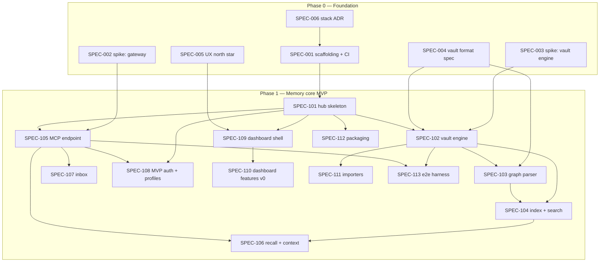

# palaia v3 — Implementation Plan

> Companion to [MASTERPLAN.md](MASTERPLAN.md). The masterplan says *what and why*;
> this document says *in which order, by whom, and how execution is verified*.
> Work is cut into SPECs under [`specs/`](specs/) that are deliberately
> self-contained enough for smaller models to execute without re-deriving the
> architecture.
>
> Version 0.1 — 2026-08-22

## 0. Standing assumptions

1. **Stack** as recommended in MASTERPLAN §8: Python 3.12+ / FastMCP 3.x / FastAPI
   core, TypeScript + React + Tailwind dashboard, SQLite index, Docker-first.
   The stack ADR (SPEC-006) formalizes this; an owner veto changes SPEC-001/006,
   not the plan's structure.
2. **License:** MIT (decided, ADR-002).
3. All v3 code lives under `v3/`; the two-track rules in `AGENTS.md` bind every
   executing agent.
4. Phases gate on their masterplan §12 exit criteria. **Phase 3–5 SPECs are
   written at the end of Phase 1/2** (per masterplan doctrine: specs per phase,
   not upfront) — their work packages and model recommendations are already
   outlined in §5 below.

## 1. Execution protocol (binding for every SPEC)

- **One SPEC = one branch = one PR.** Branch `feat/v3-spec-NNN-<slug>`, PR to
  `main`, conventional commit titles. Never touch v2 files (repo root) in a v3 PR.
- **Read first:** the SPEC file, MASTERPLAN sections it names, and every artifact
  in its `depends_on`. Do not re-decide what an ADR already decided; if a SPEC
  conflicts with reality, stop and report — don't improvise around it.
- **Definition of Done** (all of): every acceptance criterion checked; tests
  written per the SPEC's test requirements and green; `ruff check` + `mypy`
  (Python) / `eslint` + `tsc` (TS) clean; the SPEC's verification commands run
  successfully; PR description contains the acceptance checklist with each box
  ticked; docs the SPEC names are updated.
- **Scope discipline:** deliver exactly the SPEC. Adjacent improvements go into a
  note in the PR description, not into the diff.
- **Stuck rule:** if an acceptance criterion cannot be met as written, do not
  redefine it — open the PR as draft with a `BLOCKED:` section explaining why.

## 2. Model & effort guide

Recommendations use the currently available tiers (Sonnet 4, Sonnet 5, Opus 4,
Opus 5, Fable 5) and Claude Code effort levels (low/medium/high/max).

| Tier | Use for | Rationale |
|---|---|---|
| **Fable 5** | Format/grammar design, security-critical design & reviews, phase-gate reviews, authoring later-phase SPECs | Judgment-heavy work where mistakes propagate; expensive, so reserved |
| **Opus 5** | Correctness-critical engines (vault, recall, OAuth), gnarly integration debugging, design with taste (UX north star) | Strongest execution below Fable; worth it where subtle bugs are costly |
| **Sonnet 5** | The workhorse: all well-spec'd feature implementation, frontend, tooling, tests | Best cost/quality for guided implementation; this plan's default |
| **Sonnet 4** | Mechanical sub-tasks: fixtures, boilerplate, golden files, doc formatting | Cheap lane; only under a tight SPEC with verifiable output |
| **Opus 4** | Not recommended | Superseded by Sonnet 5 for coding at similar-or-lower cost; fallback only if Opus 5/Sonnet 5 are unavailable |

Rules of thumb: a **higher tier writes the SPEC/design, a lower tier executes
it**; anything touching auth, data loss, or the vault format gets a **Fable 5
review** before merge; effort `high` is for work with hidden interactions,
`medium` for guided implementation, `low` for mechanical output.

## 3. Work breakdown & dependencies

Parallel lanes once SPEC-101 lands: (a) vault engine chain 102→103→104→106,
(b) MCP endpoint chain 105→107/108, (c) dashboard 109→110, (d) packaging 112 and
harness 113. With one agent per lane, Phase 1 is four concurrent tracks.

## 4. SPEC index with model recommendations

| SPEC | Title | Depends on | Model | Effort | Review gate |
|---|---|---|---|---|---|
| [001](specs/SPEC-001-scaffolding.md) | v3 scaffolding, tooling, CI lane | 006 | Sonnet 5 | medium | — |
| [002](specs/SPEC-002-spike-gateway.md) | Spike: FastMCP gateway proof | — | Sonnet 5 | high | Fable 5 reads findings |
| [003](specs/SPEC-003-spike-vault.md) | Spike: vault round-trip proof | — | Sonnet 5 | high | Fable 5 reads findings |
| [004](specs/SPEC-004-vault-format.md) | Vault format spec v1 + ADR | 002/003 findings | **Fable 5** | high | owner sign-off |
| [005](specs/SPEC-005-ux-north-star.md) | UX north star: design system + key screens | — | **Opus 5** | high | owner sign-off |
| [006](specs/SPEC-006-stack-adr.md) | Stack ADR write-up | — | Sonnet 5 | low | owner sign-off |
| [101](specs/SPEC-101-hub-skeleton.md) | Hub daemon skeleton, config, logging | 001 | Sonnet 5 | medium | — |
| [102](specs/SPEC-102-vault-engine.md) | Vault engine (files, git, watcher) | 003, 004, 101 | **Opus 5** | high | Fable 5 review |
| [103](specs/SPEC-103-graph-parser.md) | Knowledge-graph parser | 004, 102 | Sonnet 5 | high | golden tests |
| [104](specs/SPEC-104-index-search.md) | Index & hybrid search | 102, 103 | **Opus 5** | medium | — |
| [105](specs/SPEC-105-mcp-endpoint.md) | MCP endpoint & memory tool family | 002, 101 | Sonnet 5 | high | — |
| [106](specs/SPEC-106-recall.md) | Recall, traversal, context assembly | 104, 105 | **Opus 5** | high | Fable 5 review |
| [107](specs/SPEC-107-inbox.md) | Inbox & capture contract | 105 | Sonnet 5 | medium | — |
| [108](specs/SPEC-108-mvp-auth.md) | MVP auth: per-client tokens + profiles | 101, 105 | Sonnet 5 | high | **Fable 5 review** |
| [109](specs/SPEC-109-dashboard-shell.md) | Dashboard shell & design system | 005, 101 | Sonnet 5 | high | — |
| [110](specs/SPEC-110-dashboard-v0.md) | Dashboard v0: wizard, explorer, connect | 109 | Sonnet 5 | high | owner UX pass |
| [111](specs/SPEC-111-importers.md) | Importers: palaia v2, basic-memory | 102 | Sonnet 5 | medium | golden tests |
| [112](specs/SPEC-112-packaging.md) | Docker, compose, mDNS, installer, GHCR | 101 | Sonnet 5 | medium | — |
| [113](specs/SPEC-113-e2e-harness.md) | E2E harness & golden fixtures | 102, 105 | Sonnet 5 | medium | fixtures: Sonnet 4 low |

## 4b. Phase 2 SPEC index (written at the Phase-1 gate, 2026-08-23)

Waves: **2a** = 201, 202, 203, 207, 210 (no mutual deps) → **2b** = 204, 205,
206, 208 → **2c** = 209 + Phase-2 gate (exit criterion: *phone Claude
remembers what desktop Codex learned* — a real remote client through OAuth).

| SPEC | Title | Depends on | Model | Effort | Review gate |
|---|---|---|---|---|---|
| [201](specs/SPEC-201-events-hooks.md) | Event bus & hooks v1 | 102, 109 | Sonnet 5 | high | — |
| [202](specs/SPEC-202-stash.md) | Stash tool family | 105, 108 | Sonnet 5 | low | — |
| [203](specs/SPEC-203-oauth-server.md) | OAuth 2.1 authorization server | 108 | **Opus 5** | high | **Fable 5 security review (max)** |
| [204](specs/SPEC-204-idp-signin.md) | IdP sign-in | 203 | Sonnet 5 | medium | Fable 5 review |
| [205](specs/SPEC-205-modes-exposure.md) | Modes & exposure wizard | 203, 110 | Sonnet 5 | high | — |
| [206](specs/SPEC-206-curator.md) | The curator (policy fixed in-spec) | 201, 106 | **Opus 5** | medium | Fable 5 review |
| [207](specs/SPEC-207-autocapture-skills.md) | Auto-capture & memory-use skills | 107, 106 | **Opus 5** | high | effectiveness runs |
| [208](specs/SPEC-208-mcp-apps.md) | MCP Apps (status, recall, review) | 110, 206 | Sonnet 5 | high | owner UX pass |
| [209](specs/SPEC-209-client-matrix.md) | Client matrix validation | 203, 205 | Sonnet 5 | low | gate evidence |
| [210](specs/SPEC-210-phase1-followups.md) | Phase-1 follow-ups | 104, 110, 111 | Sonnet 5 | medium | — |

## 4c. Phase 3 SPEC index (written at the Phase-2 gate, 2026-08-24)

Waves: **3a** = 301, 303, 306, 307 (no mutual deps; 301 is the shared
foundation and integrates first) → **3b** = 302, 305 (both need 301) →
**3c** = 304 (needs 302 + 303), then 308 + Phase-3 gate (exit criterion:
*install a tool once, every AI has it*).

| SPEC | Title | Depends on | Model | Effort | Review gate |
|---|---|---|---|---|---|
| [301](specs/SPEC-301-gateway-config.md) | Gateway config in config.yaml | 210, 203, 205, 206 | Sonnet 5 | high | Fable 5 review (audience wiring) |
| [302](specs/SPEC-302-external-servers.md) | External servers + secret store | 301 | **Opus 5** | medium | **Fable 5 security review (max)** |
| [303](specs/SPEC-303-registry-index.md) | Registry client + curated index | 101 | Sonnet 5 | medium | Fable 5 review (index signing) |
| [304](specs/SPEC-304-marketplace.md) | Marketplace v1 + MCP App | 302, 303 | Sonnet 5 | high | owner UX pass |
| [305](specs/SPEC-305-profile-editor.md) | Profile editor | 301 | Sonnet 5 | medium | — |
| [306](specs/SPEC-306-mcpb-bundles.md) | MCPB + one-click bundles | 203, 205 | Sonnet 5 | high | Fable 5 review (signing story) |
| [307](specs/SPEC-307-automations.md) | Automations editor | 201 | Sonnet 5 | medium | — |
| [308](specs/SPEC-308-phase3-gate.md) | Phase-3 gate evidence | 301–306 | Sonnet 5 | medium | gate evidence |

## 5. Phase 2 work packages (superseded by §4b — kept for provenance)

| Package | Content | Model | Effort |
|---|---|---|---|
| OAuth 2.1 AS | RFC 9728 metadata, OIDC discovery, CIMD + DCR fallback, grace-windowed rotation, client GC, audience resolution (mcp-hub lessons, MASTERPLAN §5.5) | **Opus 5** | high + **Fable 5 security review (max)** |
| IdP sign-in | GitHub/Google/OIDC, one-door rule | Sonnet 5 | medium |
| Operating modes & exposure wizard | Locked/Cloud/Open enforcement, tunnel add-ons (Tailscale/cloudflared) | Sonnet 5 | high |
| Curator: policy & prompts | Two-tier rule, capture contract, guard design, curation prompt | **Fable 5** | high |
| Curator: runner | Headless sessions, verification loop, apply path (no model), retries | Opus 5 | medium |
| Event bus & hooks v1 | Public event schema, subscriptions, webhook/notify actions | Sonnet 5 | high |
| Stash | KV/cache tool family (well-understood from mcp-hub) | Sonnet 4 | medium |
| Auto-capture skills | Per-client SKILL.md packages feeding the inbox | Opus 5 | high |
| MCP Apps: review queue, recall explorer, hub status | App shell + three apps (§5.7) | Sonnet 5 | high |
| Client matrix validation | Connect + regression-test each client path | Sonnet 4 | medium |

## 6. Phase gates

- **Gate P0→P1:** both spikes reported, vault format v1 signed off, stack ADR
  accepted, CI lane green on a hello-world workspace. Reviewer: **Fable 5** +
  owner.
- **Gate P1→P2:** masterplan exit criterion demonstrated end-to-end (two
  providers share one memory; install without shell beyond one docker command),
  e2e harness green, importers round-trip golden vaults, owner UX pass on the
  dashboard. Reviewer: **Fable 5** (writes the Phase-2 SPECs at this gate).
- **Gate P2→P3 (held 2026-08-24):** every Phase-2 ship merged and integrated
  (SPECs 201–210: events+hooks, stash, OAuth 2.1 server, IdP sign-in,
  modes+exposure wizard, curator, skills, MCP Apps, client matrix, dynamic
  mounting), full suite green at 1436 tests. Exit criterion *"phone Claude
  remembers what desktop Codex learned"* demonstrated up to the vendor-cloud
  boundary: shared memory across providers (Phase-1 S1, still green), plus a
  **real, completed OAuth login and tool round-trip by an actual native
  client on the default zero-flag path** against a Cloud-mode hub
  (SPEC-209 e2e; unblocked by the RFC 8252 §7.3 fix, issue #233). The
  literal phone half needs a real claude.ai account against a publicly
  reachable hub — a documented ~5-minute owner action
  (`docs/client-matrix-results.md` says exactly what to run), not something
  this environment can fake honestly. Reviewer: **Fable 5** (writes the
  Phase-3 SPECs at this gate) + owner (phone test + UX pass on the new
  exposure/settings/review screens).
- **Gate P3→P4 (draft — the architect holds the gate):** SPEC-308 assembled
  the evidence for the Phase-3 exit criterion, *"install a tool once, every
  AI has it"* — it does not itself decide whether the gate is met; that
  judgment is the architect's (Fable 5 + owner), same as every prior gate.
  What SPEC-308 put on the table: a curated-index entry, installed exactly
  once through the real `/api/market/*` REST flow (consent token included)
  onto two gateway profiles at once, then read back by two differently
  authenticated real clients with zero client-side tool configuration — the
  real `claude` CLI over a real OAuth 2.1 + PKCE code flow, and a scripted
  `fastmcp.Client` carrying a real SPEC-108 `plt_` token — and, separately,
  through the real SPEC-306 stdio proxy with no bundle rebuild in between
  (`v3/docs/client-matrix-results.md` §7 has the full trace, run three times
  with no flakes). No new quirks were filed this time (SPEC-301's
  OAuth+`plt_` combination and SPEC-304's install flow both behaved exactly
  as documented on the first real two-profile run). What this evidence does
  **not** cover, honestly: the dashboard's own UI (only its REST surface was
  driven), a real public tunnel in front of the hub, and Claude Desktop's
  own MCPB install dialog (§6 already carries that gap; SPEC-308 adds
  nothing new there). Whether that residual scope is acceptable for the
  gate, and what Phase 4 should look like, is the architect's call to make
  at the review this paragraph is drafted for.
