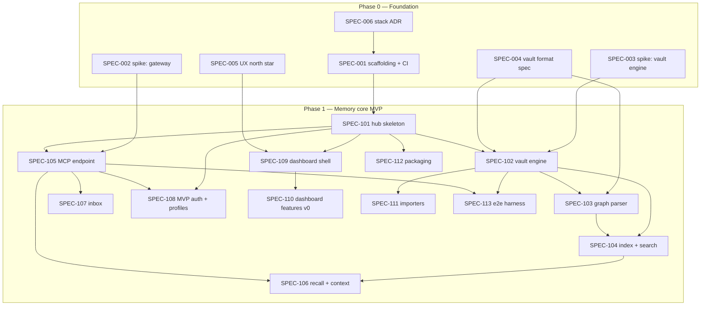

# palaia v3 — Implementation Plan

> Companion to [MASTERPLAN.md](MASTERPLAN.md). The masterplan says *what and why*;
> this document says *in which order, by whom, and how execution is verified*.
> Work is cut into SPECs under [`specs/`](specs/) that are deliberately
> self-contained enough for smaller models to execute without re-deriving the
> architecture.
>
> Version 0.1 — 2026-08-22

## 0. Standing assumptions

1. **Stack** as recommended in MASTERPLAN §8: Python 3.12+ / FastMCP 3.x / FastAPI
   core, TypeScript + React + Tailwind dashboard, SQLite index, Docker-first.
   The stack ADR (SPEC-006) formalizes this; an owner veto changes SPEC-001/006,
   not the plan's structure.
2. **License:** MIT (decided, ADR-002).
3. All v3 code lives under `v3/`; the two-track rules in `AGENTS.md` bind every
   executing agent.
4. Phases gate on their masterplan §12 exit criteria. **Phase 3–5 SPECs are
   written at the end of Phase 1/2** (per masterplan doctrine: specs per phase,
   not upfront) — their work packages and model recommendations are already
   outlined in §5 below.

## 1. Execution protocol (binding for every SPEC)

- **One SPEC = one branch = one PR.** Branch `feat/v3-spec-NNN-<slug>`, PR to
  `main`, conventional commit titles. Never touch v2 files (repo root) in a v3 PR.
- **Read first:** the SPEC file, MASTERPLAN sections it names, and every artifact
  in its `depends_on`. Do not re-decide what an ADR already decided; if a SPEC
  conflicts with reality, stop and report — don't improvise around it.
- **Definition of Done** (all of): every acceptance criterion checked; tests
  written per the SPEC's test requirements and green; `ruff check` + `mypy`
  (Python) / `eslint` + `tsc` (TS) clean; the SPEC's verification commands run
  successfully; PR description contains the acceptance checklist with each box
  ticked; docs the SPEC names are updated.
- **Scope discipline:** deliver exactly the SPEC. Adjacent improvements go into a
  note in the PR description, not into the diff.
- **Stuck rule:** if an acceptance criterion cannot be met as written, do not
  redefine it — open the PR as draft with a `BLOCKED:` section explaining why.

## 2. Model & effort guide

Recommendations use the currently available tiers (Sonnet 4, Sonnet 5, Opus 4,
Opus 5, Fable 5) and Claude Code effort levels (low/medium/high/max).

| Tier | Use for | Rationale |
|---|---|---|
| **Fable 5** | Format/grammar design, security-critical design & reviews, phase-gate reviews, authoring later-phase SPECs | Judgment-heavy work where mistakes propagate; expensive, so reserved |
| **Opus 5** | Correctness-critical engines (vault, recall, OAuth), gnarly integration debugging, design with taste (UX north star) | Strongest execution below Fable; worth it where subtle bugs are costly |
| **Sonnet 5** | The workhorse: all well-spec'd feature implementation, frontend, tooling, tests | Best cost/quality for guided implementation; this plan's default |
| **Sonnet 4** | Mechanical sub-tasks: fixtures, boilerplate, golden files, doc formatting | Cheap lane; only under a tight SPEC with verifiable output |
| **Opus 4** | Not recommended | Superseded by Sonnet 5 for coding at similar-or-lower cost; fallback only if Opus 5/Sonnet 5 are unavailable |

Rules of thumb: a **higher tier writes the SPEC/design, a lower tier executes
it**; anything touching auth, data loss, or the vault format gets a **Fable 5
review** before merge; effort `high` is for work with hidden interactions,
`medium` for guided implementation, `low` for mechanical output.

## 3. Work breakdown & dependencies

Parallel lanes once SPEC-101 lands: (a) vault engine chain 102→103→104→106,
(b) MCP endpoint chain 105→107/108, (c) dashboard 109→110, (d) packaging 112 and
harness 113. With one agent per lane, Phase 1 is four concurrent tracks.

## 4. SPEC index with model recommendations

| SPEC | Title | Depends on | Model | Effort | Review gate |
|---|---|---|---|---|---|
| [001](specs/SPEC-001-scaffolding.md) | v3 scaffolding, tooling, CI lane | 006 | Sonnet 5 | medium | — |
| [002](specs/SPEC-002-spike-gateway.md) | Spike: FastMCP gateway proof | — | Sonnet 5 | high | Fable 5 reads findings |
| [003](specs/SPEC-003-spike-vault.md) | Spike: vault round-trip proof | — | Sonnet 5 | high | Fable 5 reads findings |
| [004](specs/SPEC-004-vault-format.md) | Vault format spec v1 + ADR | 002/003 findings | **Fable 5** | high | owner sign-off |
| [005](specs/SPEC-005-ux-north-star.md) | UX north star: design system + key screens | — | **Opus 5** | high | owner sign-off |
| [006](specs/SPEC-006-stack-adr.md) | Stack ADR write-up | — | Sonnet 5 | low | owner sign-off |
| [101](specs/SPEC-101-hub-skeleton.md) | Hub daemon skeleton, config, logging | 001 | Sonnet 5 | medium | — |
| [102](specs/SPEC-102-vault-engine.md) | Vault engine (files, git, watcher) | 003, 004, 101 | **Opus 5** | high | Fable 5 review |
| [103](specs/SPEC-103-graph-parser.md) | Knowledge-graph parser | 004, 102 | Sonnet 5 | high | golden tests |
| [104](specs/SPEC-104-index-search.md) | Index & hybrid search | 102, 103 | **Opus 5** | medium | — |
| [105](specs/SPEC-105-mcp-endpoint.md) | MCP endpoint & memory tool family | 002, 101 | Sonnet 5 | high | — |
| [106](specs/SPEC-106-recall.md) | Recall, traversal, context assembly | 104, 105 | **Opus 5** | high | Fable 5 review |
| [107](specs/SPEC-107-inbox.md) | Inbox & capture contract | 105 | Sonnet 5 | medium | — |
| [108](specs/SPEC-108-mvp-auth.md) | MVP auth: per-client tokens + profiles | 101, 105 | Sonnet 5 | high | **Fable 5 review** |
| [109](specs/SPEC-109-dashboard-shell.md) | Dashboard shell & design system | 005, 101 | Sonnet 5 | high | — |
| [110](specs/SPEC-110-dashboard-v0.md) | Dashboard v0: wizard, explorer, connect | 109 | Sonnet 5 | high | owner UX pass |
| [111](specs/SPEC-111-importers.md) | Importers: palaia v2, basic-memory | 102 | Sonnet 5 | medium | golden tests |
| [112](specs/SPEC-112-packaging.md) | Docker, compose, mDNS, installer, GHCR | 101 | Sonnet 5 | medium | — |
| [113](specs/SPEC-113-e2e-harness.md) | E2E harness & golden fixtures | 102, 105 | Sonnet 5 | medium | fixtures: Sonnet 4 low |

## 4b. Phase 2 SPEC index (written at the Phase-1 gate, 2026-08-23)

Waves: **2a** = 201, 202, 203, 207, 210 (no mutual deps) → **2b** = 204, 205,
206, 208 → **2c** = 209 + Phase-2 gate (exit criterion: *phone Claude
remembers what desktop Codex learned* — a real remote client through OAuth).

| SPEC | Title | Depends on | Model | Effort | Review gate |
|---|---|---|---|---|---|
| [201](specs/SPEC-201-events-hooks.md) | Event bus & hooks v1 | 102, 109 | Sonnet 5 | high | — |
| [202](specs/SPEC-202-stash.md) | Stash tool family | 105, 108 | Sonnet 5 | low | — |
| [203](specs/SPEC-203-oauth-server.md) | OAuth 2.1 authorization server | 108 | **Opus 5** | high | **Fable 5 security review (max)** |
| [204](specs/SPEC-204-idp-signin.md) | IdP sign-in | 203 | Sonnet 5 | medium | Fable 5 review |
| [205](specs/SPEC-205-modes-exposure.md) | Modes & exposure wizard | 203, 110 | Sonnet 5 | high | — |
| [206](specs/SPEC-206-curator.md) | The curator (policy fixed in-spec) | 201, 106 | **Opus 5** | medium | Fable 5 review |
| [207](specs/SPEC-207-autocapture-skills.md) | Auto-capture & memory-use skills | 107, 106 | **Opus 5** | high | effectiveness runs |
| [208](specs/SPEC-208-mcp-apps.md) | MCP Apps (status, recall, review) | 110, 206 | Sonnet 5 | high | owner UX pass |
| [209](specs/SPEC-209-client-matrix.md) | Client matrix validation | 203, 205 | Sonnet 5 | low | gate evidence |
| [210](specs/SPEC-210-phase1-followups.md) | Phase-1 follow-ups | 104, 110, 111 | Sonnet 5 | medium | — |

## 4c. Phase 3 SPEC index (written at the Phase-2 gate, 2026-08-24)

Waves: **3a** = 301, 303, 306, 307 (no mutual deps; 301 is the shared
foundation and integrates first) → **3b** = 302, 305 (both need 301) →
**3c** = 304 (needs 302 + 303), then 308 + Phase-3 gate (exit criterion:
*install a tool once, every AI has it*).

| SPEC | Title | Depends on | Model | Effort | Review gate |
|---|---|---|---|---|---|
| [301](specs/SPEC-301-gateway-config.md) | Gateway config in config.yaml | 210, 203, 205, 206 | Sonnet 5 | high | Fable 5 review (audience wiring) |
| [302](specs/SPEC-302-external-servers.md) | External servers + secret store | 301 | **Opus 5** | medium | **Fable 5 security review (max)** |
| [303](specs/SPEC-303-registry-index.md) | Registry client + curated index | 101 | Sonnet 5 | medium | Fable 5 review (index signing) |
| [304](specs/SPEC-304-marketplace.md) | Marketplace v1 + MCP App | 302, 303 | Sonnet 5 | high | owner UX pass |
| [305](specs/SPEC-305-profile-editor.md) | Profile editor | 301 | Sonnet 5 | medium | — |
| [306](specs/SPEC-306-mcpb-bundles.md) | MCPB + one-click bundles | 203, 205 | Sonnet 5 | high | Fable 5 review (signing story) |
| [307](specs/SPEC-307-automations.md) | Automations editor | 201 | Sonnet 5 | medium | — |
| [308](specs/SPEC-308-phase3-gate.md) | Phase-3 gate evidence | 301–306 | Sonnet 5 | medium | gate evidence |

## 4d. Phase 4 SPEC index (written at the Phase-3 gate, 2026-08-24)

Waves: **4a** = 401, 402, 406 (no mutual deps; 401 is security-critical
and integrates first) → **4b** = 403 (needs 402) → **4c** = 404, 405 (both
need 403), then 407 + Phase-4 gate (exit criterion: *two agents on
different providers hand off work through palaia*).

| SPEC | Title | Depends on | Model | Effort | Review gate |
|---|---|---|---|---|---|
| [401](specs/SPEC-401-dashboard-signin.md) | Dashboard sign-in (admin session gate, closes #242) | 203, 204, 205 | **Opus 5** | medium | **Fable 5 security review (max)** |
| [402](specs/SPEC-402-session-directory.md) | Session directory | 105, 201 | Sonnet 5 | high | Fable 5 review (session secret) |
| [403](specs/SPEC-403-messenger.md) | Messenger core (envelope fixed in-spec) | 402, 106 | **Opus 5** | medium | Fable 5 review (inbox auth) |
| [404](specs/SPEC-404-messaging-skills.md) | Messaging skills + push adapters | 403, 207 | Sonnet 5 | high | effectiveness runs |
| [405](specs/SPEC-405-observability.md) | Team observability (screens + 2 MCP Apps) | 402, 403, 208 | Sonnet 5 | high | owner UX pass |
| [406](specs/SPEC-406-addon-sdk.md) | Add-on SDK + submission flow | 303, 304 | Sonnet 5 | medium | — |
| [407](specs/SPEC-407-phase4-gate.md) | Phase-4 gate evidence | 401–405 | Sonnet 5 | medium | gate evidence |

## 4e. Phase 5 SPEC index (written at the Phase-4 gate, 2026-08-25)

Waves: **5a** = 501, 502, 503, 505 (no mutual deps) → **5b** = 504 (needs
503's theme + 501's install paths) → **5c** = 506 + Phase-5 gate (exit
criterion: *a non-developer completes install → first shared memory
unaided* — scripted twin + the owner's real-person session per the shipped
protocol).

| SPEC | Title | Depends on | Model | Effort | Review gate |
|---|---|---|---|---|---|
| [501](specs/SPEC-501-distribution.md) | App-store packages, channels, self-update | 112 | Sonnet 5 | high | — |
| [502](specs/SPEC-502-hardening.md) | Hardening pass + external-review brief | 401, 302, 203 | **Opus 5** | high | **Fable 5 security review (max)** |
| [503](specs/SPEC-503-docs-site.md) | Docs site | 110, 304, 405 | Sonnet 5 | high | owner pass |
| [504](specs/SPEC-504-onboarding.md) | Onboarding page + first-run funnel | 503, 501, 110 | Sonnet 5 | high | owner UX pass |
| [505](specs/SPEC-505-v2-sunset.md) | v2 sunset + migration guide | 111 | Sonnet 5 | medium | owner (timeline) |
| [506](specs/SPEC-506-phase5-gate.md) | RC + gate evidence | 501–505 | Sonnet 5 | medium | gate evidence |

## 4f. Phase 6 SPEC index (owner-directed, 2026-08-31: "every install path and day-2 operation at 5-star ease")

Scope set in planning with the owner: VPS gets cloud-init (an image is the
wrong vehicle there), Synology gets a no-terminal walkthrough (owner has a
test device), the Pi gets the flash-and-boot appliance image (#280 — also
the load-measurement platform that gates the Home Assistant add-on
decision), and operations gets the missing backup/restore floor.
Explicitly deferred by the owner: native Mac/Windows (the hub should not
live on a laptop), the HA add-on (until #280's measurements exist), bare
metal without Docker (deliberate non-goal). Store submissions remain owner
actions.

Waves: **6a** = 601, 602 (independent, docs/deploy only) → **6b** = 603,
604 (independent of each other; 604 touches server+web, so it waits for
the in-flight issue-fix PRs to land first).

| SPEC | Title | Depends on | Model | Effort | Review gate |
|---|---|---|---|---|---|
| [601](specs/SPEC-601-cloud-init.md) | Cloud-init VPS install (Tailscale) | 501, 504 | Sonnet 5 | medium | owner boot test |
| [602](specs/SPEC-602-synology-guide.md) | Synology walkthrough, no terminal | 503, 504 | Sonnet 5 | low | owner device pass |
| [603](specs/SPEC-603-pi-appliance-image.md) | Pi appliance image pipeline (#280) | 501 | Sonnet 5 | high | owner boot test + measurements |
| [604](specs/SPEC-604-backup-restore.md) | Backup & restore floor | 401, 501 | Sonnet 5 | high | **Fable 5 security review** (admin-gated secret-bearing endpoint) |

## 5. Phase 2 work packages (superseded by §4b — kept for provenance)

| Package | Content | Model | Effort |
|---|---|---|---|
| OAuth 2.1 AS | RFC 9728 metadata, OIDC discovery, CIMD + DCR fallback, grace-windowed rotation, client GC, audience resolution (mcp-hub lessons, MASTERPLAN §5.5) | **Opus 5** | high + **Fable 5 security review (max)** |
| IdP sign-in | GitHub/Google/OIDC, one-door rule | Sonnet 5 | medium |
| Operating modes & exposure wizard | Locked/Cloud/Open enforcement, tunnel add-ons (Tailscale/cloudflared) | Sonnet 5 | high |
| Curator: policy & prompts | Two-tier rule, capture contract, guard design, curation prompt | **Fable 5** | high |
| Curator: runner | Headless sessions, verification loop, apply path (no model), retries | Opus 5 | medium |
| Event bus & hooks v1 | Public event schema, subscriptions, webhook/notify actions | Sonnet 5 | high |
| Stash | KV/cache tool family (well-understood from mcp-hub) | Sonnet 4 | medium |
| Auto-capture skills | Per-client SKILL.md packages feeding the inbox | Opus 5 | high |
| MCP Apps: review queue, recall explorer, hub status | App shell + three apps (§5.7) | Sonnet 5 | high |
| Client matrix validation | Connect + regression-test each client path | Sonnet 4 | medium |

## 6. Phase gates

- **Gate P0→P1:** both spikes reported, vault format v1 signed off, stack ADR
  accepted, CI lane green on a hello-world workspace. Reviewer: **Fable 5** +
  owner.
- **Gate P1→P2:** masterplan exit criterion demonstrated end-to-end (two
  providers share one memory; install without shell beyond one docker command),
  e2e harness green, importers round-trip golden vaults, owner UX pass on the
  dashboard. Reviewer: **Fable 5** (writes the Phase-2 SPECs at this gate).
- **Gate P2→P3 (held 2026-08-24):** every Phase-2 ship merged and integrated
  (SPECs 201–210: events+hooks, stash, OAuth 2.1 server, IdP sign-in,
  modes+exposure wizard, curator, skills, MCP Apps, client matrix, dynamic
  mounting), full suite green at 1436 tests. Exit criterion *"phone Claude
  remembers what desktop Codex learned"* demonstrated up to the vendor-cloud
  boundary: shared memory across providers (Phase-1 S1, still green), plus a
  **real, completed OAuth login and tool round-trip by an actual native
  client on the default zero-flag path** against a Cloud-mode hub
  (SPEC-209 e2e; unblocked by the RFC 8252 §7.3 fix, issue #233). The
  literal phone half needs a real claude.ai account against a publicly
  reachable hub — a documented ~5-minute owner action
  (`docs/client-matrix-results.md` says exactly what to run), not something
  this environment can fake honestly. Reviewer: **Fable 5** (writes the
  Phase-3 SPECs at this gate) + owner (phone test + UX pass on the new
  exposure/settings/review screens).
- **Gate P3→P4 (held 2026-08-24):** every Phase-3 ship merged and
  integrated (SPECs 301–308: gateway config as first-class config, external
  servers + encrypted secret store, registry client + signed curated index,
  marketplace v1 with consent-gated installs and its MCP App, profile
  editor, MCPB/one-click bundles, automations editor), full suite green at
  1711 tests. Exit criterion *"install a tool once, every AI has it"*
  demonstrated with SPEC-308's evidence: a curated-index entry, installed exactly
  once through the real `/api/market/*` REST flow (consent token included)
  onto two gateway profiles at once, then read back by two differently
  authenticated real clients with zero client-side tool configuration — the
  real `claude` CLI over a real OAuth 2.1 + PKCE code flow, and a scripted
  `fastmcp.Client` carrying a real SPEC-108 `plt_` token — and, separately,
  through the real SPEC-306 stdio proxy with no bundle rebuild in between
  (`v3/docs/client-matrix-results.md` §7 has the full trace, run three times
  with no flakes). No new quirks were filed this time (SPEC-301's
  OAuth+`plt_` combination and SPEC-304's install flow both behaved exactly
  as documented on the first real two-profile run). What this evidence does
  **not** cover, honestly: the dashboard's own UI (only its REST surface was
  driven), a real public tunnel in front of the hub, and Claude Desktop's
  own MCPB install dialog (§6 already carries that gap; SPEC-308 adds
  nothing new there). Gate verdict: the residual items are UI polish and
  environment facts, not exit-criterion substance — the criterion is about
  the install-once/available-everywhere mechanics, which three independent
  real client paths exercised. Accepted, with the owner's standing UX pass
  and the #242 dashboard-sign-in work carried into Phase 4's hardening
  scope. Reviewer: **Fable 5** (writes the Phase-4 SPECs at this gate) +
  owner (UX pass over marketplace/profiles/automations screens).
- **Gate P4→P5 (held 2026-08-25):** every Phase-4 ship merged and
  integrated (SPECs 401–406:
  dashboard sign-in, session directory, messenger core, messaging skills +
  push adapters, team observability, add-on SDK). Exit criterion *"two
  agents on different providers hand off work through palaia"* demonstrated
  with SPEC-407's evidence
  (`v3/docs/client-matrix-results.md` §8 has the full trace): the real
  `claude` CLI (OAuth, profile `default`) registered, saved a fact to
  memory, discovered a live peer through the session directory by a scope
  query — never a hardcoded handle, provably so, since directory handles
  are fresh random tokens the CLI's prompt/config never carried — and sent
  it a `handoff` envelope carrying a `memory://` reference instead of the
  fact itself; a scripted `fastmcp.Client` carrying a real SPEC-108 `plt_`
  token, on the `mobile` profile, checked its own inbox and followed that
  reference with `recall`, and its real recall output contained A's exact
  fact. Run four times in a row, no flakes. This sandbox has no `codex`
  binary, so the second party is a second-provider-*shaped* scripted
  client rather than a second real vendor CLI — the same wire-level
  substitution SPEC-209 and SPEC-308 already made and this SPEC's own task
  explicitly sanctioned; the envelope shape, the directory query grammar
  and the session-secret authorization it exercises are all
  provider-agnostic protocol, not anything the real `claude` CLI gets
  specially. A real quirk was found and fixed in the same PR
  ([#257](https://github.com/byte5ai/palaia/issues/257)): a `plt_` token
  could not be minted with `directory:*`/`messenger:*` scopes at all
  through the real REST surface — the `plt_`-side twin of the OAuth
  scope-ceiling bug SPEC-403 had already fixed on the OAuth side. The
  skill-driven variant (SPEC-404's harness, `PALAIA_EFFECTIVENESS=1`, 3 real
  runs per probe — this SPEC's stated budget) found the unprompted handoff
  firing 3/3 times and the unprompted inbox-check firing 3/3 times as well
  (`v3/docs/client-matrix-results.md` §8.4 has the full trace and cost),
  reported honestly as a rate rather than hard-asserted per the SPEC's own
  instruction — six real runs total, not a claim about the general-case
  rate. What this
  evidence does **not** cover, honestly: a real second AI provider's own
  binary (no `codex` in this sandbox), a real public tunnel, and every gap
  §6/§7.4 above already carry (the dashboard's own UI, Claude Desktop's
  MCPB dialog, the owner's phone test) — SPEC-407 adds nothing new to any
  of those. **This paragraph is a draft: the architect holds the gate** —
  it records what was run and observed, not a verdict on whether Phase 4's
  exit criterion is met or what Phase 5 should be.
- **Gate P5 (3.0 release candidate; held 2026-08-26):** every Phase-5
  ship merged and integrated (SPECs 501–505: app-store distribution +
  channels + self-update, a hardening pass + external-review brief, the
  docs site + onboarding page, v2 sunset messaging), full suite green.
  Exit criterion *"a non-developer completes install → first shared
  memory unaided"* has two halves: the scriptable half, demonstrated by
  SPEC-506's evidence (`v3/docs/client-matrix-results.md` §9), and the
  literal, real-person half, which this environment cannot supply and
  which SPEC-506 explicitly names as an owner action
  (`v3/docs/usability-test-protocol.md`, ready to hand to a tester).
  Release engineering: one version, `3.0.0-rc1`, in `v3/VERSION`, checked
  against every artifact that carries a literal version string (server,
  web, sdk) by `server/tests/test_version_drift.py`, plus a real
  `npm run build` transcript proving the mcpb bundle picks the same
  version up with zero explicit configuration (this PR's description has
  the output); `v3/CHANGELOG.md` generated from all 69 merged PRs against
  `claude/palaia-major-rewrite-lj5v9x` (#203–#271) and hand-curated by
  capability, not SPEC number; a scripted release dry-run
  (`v3/tools/release-dry-run.sh`) that actually runs the drift test, packs
  and signs a real mcpb bundle, and reports what the release workflow
  would tag/push for this version, all without touching a remote. Gate
  evidence: the funnel e2e (fresh home → wizard → vault → a real `claude`
  CLI over a real OAuth 2.1 default path → first memory → a `plt_`-token
  second client → recall) run twice, green both times, well inside
  MASTERPLAN §13's <5 minute machine-time target both times (12.25s/8.53s
  hub-side, then 10.57s/7.15s hub-side — `client-matrix-results.md` §9.1
  has both full transcripts); the Docker one-liner smoke, honestly
  env-skipped in this sandbox (no reachable docker daemon), resting on
  SPEC-112's own standing evidence plus the release workflow's own arm64
  QEMU health-check step named in §9.4. Two real, honest product gaps
  were found while building the funnel test and filed rather than fixed
  ([#272](https://github.com/byte5ai/palaia/issues/272): OAuth-
  authenticated clients never fire the funnel's `client_connected_at`;
  [#273](https://github.com/byte5ai/palaia/issues/273): an operator
  cannot pre-declare OAuth scopes for a vault the wizard hasn't created
  yet through `config.yaml`) — neither blocks any of this SPEC's
  acceptance criteria. What this evidence does **not** cover, honestly:
  the literal non-developer session (the whole point of shipping the
  protocol as an owner action instead of asserting it), a real rc Docker
  image smoke-tested end to end, and every standing gap §2/§6/§7.4/§8.5
  above already carry (a real phone/claude.ai account, a real `codex`
  binary, a real public tunnel, the dashboard's own click-through UI,
  Claude Desktop's MCPB install dialog) — this SPEC adds nothing new to
  any of those. `v3/RELEASING.md` is the ordered checklist from here to a
  final, non-candidate `3.0.0` tag, with every owner-only step (the
  external security review, the real usability session, store
  submissions, DNS/hosting, the migration guide's `[DECISION:]` dates)
  marked as such. **Architect's verdict (2026-08-26): gate held,
  conditionally.** The scriptable half of the exit criterion is met: the
  funnel e2e was independently re-run during integration (green, docker
  smoke env-skipped with the same fallback evidence), the full suite was
  independently green on every Phase-5 PR before merge (2210–2215 passed
  depending on env-gated skips; identical collected totals), and the
  release plumbing (VERSION, drift test, changelog, dry-run, RELEASING.md)
  is in place and verified. `3.0.0-rc1` stands as the release candidate.
  The gate's two open conditions are exactly `v3/RELEASING.md` §1: the
  real non-developer usability session (protocol shipped, owner runs it)
  and the external security review (brief shipped, owner procures it).
  Neither is waived — `3.0.0` final must not be tagged until both are
  done; RELEASING.md sequences this and no automation in this repository
  can bypass it. Phase 5 is thereby complete as a development phase; what
  remains on the road to `3.0.0` is owner work, not engineering scope.
