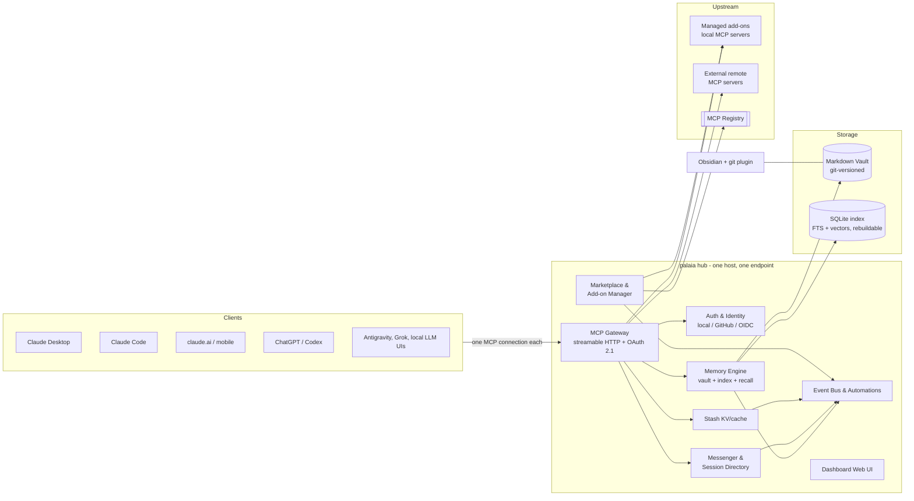

# palaia v3 — Masterplan

> **Living document.** This is the source of truth for palaia v3 scope, architecture,
> and roadmap. Scope changes go through PRs that update this file. Decisions are
> recorded in [`decisions/`](decisions/), supporting research in [`research/`](research/).
>
> Version 0.1 — 2026-08-22 — owner: cwendler (byte5)

---

## 0. TL;DR

**palaia v3 is Home Assistant for AI.** A self-hosted, open-source hub that gives all
of a user's AI systems — Claude, ChatGPT/Codex, Antigravity, Grok, local LLMs — one
shared memory, one central toolbox, and one way to talk to each other.

Install it once on any Linux box (or laptop) the way you'd install Home Assistant:
one command, then everything happens in a friendly web UI. Every AI client connects to
**one endpoint** instead of being configured tool-by-tool. What one agent learns, every
agent knows. Tools are installed once, in palaia, and appear everywhere.

v3 is a ground-up rewrite. v2 (a memory system primarily for OpenClaw) remains
available and hotfix-able on the `v2-maintenance` branch; its best concepts live on
in v3 (see [research/palaia2-feature-inventory.md](research/palaia2-feature-inventory.md)).

## 1. The Problem

AI power users today run **N clients × M tools**, and every cell of that matrix is
manual work:

- **Configuration sprawl.** Every MCP server must be configured in every client —
  Claude Desktop, Claude Code, ChatGPT, Codex, each IDE — with its own JSON/TOML
  syntax, its own credentials, its own update cycle.
- **Memory silos.** Each provider remembers (at best) its own conversations. Nothing
  learned in Claude reaches Codex. Nothing survives a provider switch. The user's
  accumulated context is scattered and mostly lost.
- **Blind, mute agents.** Concurrent agent sessions don't know each other. They
  duplicate work, collide on files, and cannot hand anything off — across providers
  there is no channel at all.
- **Expert-only self-hosting.** Existing building blocks (memory servers, MCP
  gateways, agent platforms) assume a terminal-native user. Nothing in this space has
  had its "Home Assistant moment": the appliance that made a hard domain accessible.

palaia v3 collapses N×M to **N+M**: each client connects once to palaia; each tool is
installed once in palaia. The hub does the rest.

## 2. Target Users

| Persona | Situation | What palaia gives them |
|---|---|---|
| **The multi-AI power user** (primary) | Uses Claude Code *and* Codex *and* a desktop chat app daily; pays for 2–3 subscriptions | One memory across all of them, tools configured once, phone access to the same brain |
| **The self-hoster / homelab user** | Runs Home Assistant, Umbrel or a NAS; comfortable installing apps, allergic to config files | An appliance-grade install, a beautiful dashboard, everything manageable in the browser |
| **The AI-heavy small team** (secondary) | 2–10 people, shared projects, agents working in repos | Shared team memory with scopes, an agent directory, observable agent-to-agent handoffs |
| **The tinkerer / developer** (ecosystem) | Builds MCP tools and skills | An add-on SDK and a store that puts their tool in front of users with one click |

Explicit **non-goals**: palaia is not a chat UI, not an LLM host (it doesn't run
models), not an agent framework (it doesn't orchestrate reasoning), not a vector-DB
product, and not a cloud service (local-first; optional relay is a later, separate
decision).

## 3. Product Pillars

### P1 — Memory (the core)
A shared, human-readable, git-versioned knowledge vault, served to every client via
MCP. The best concepts of palaia v2 (hybrid search, scopes, decay-ranked recall,
auto-capture, dedup, doctor), basic-memory (Markdown-first knowledge graph, Obsidian
compatibility, files as source of truth) and mcp-hub (inbox + curator: agents drop,
a job curates) — reimplemented clean-room where licensing demands it
(see [ADR-002](decisions/002-clean-room-licensing.md)).

### P2 — Gateway ("configure once, use everywhere")
One MCP endpoint that aggregates everything behind it: palaia's built-in tools,
installed add-ons, and external MCP servers the user connects. Central auth, central
credential storage, per-client tool profiles. palaia sits as the layer between MCP
servers and AI clients — the multiple-setup problem disappears.

### P3 — Marketplace (the app store)
Browse, install, update and configure MCP tools and agent skills from the dashboard —
one click, no shell. Sources: the official MCP registry, a curated palaia add-on
store, and manual custom entries. Like Home Assistant's add-on store, this is what
turns a tool into a platform.

### P4 — Agent Directory & Messenger
Sessions become visible: what each agent is working on, where it runs, which model,
how long idle. On top of that, a cross-host, cross-provider messenger with
*structured* messages — designed so agents actually use it, and don't waste tokens
chatting (see §5.4).

### P5 — Stash
Cross-session cache for structured data (an existing in-house tool, integrated as a
built-in): intermediate results, handoff payloads, expensive computations — with TTL
and size discipline, separate from long-term memory.

### P6 — Automations & Hooks
An event bus over everything (memory written, message received, session idle, add-on
updated…) with user-defined reactions — webhooks, notifications, tool runs, memory
writes. Home Assistant's automation model, applied to AI infrastructure. This is a
gap in every comparable tool (basic-memory has no hooks at all).

### P7 — Dashboard
The face of the product and the primary interface: onboarding wizard, memory explorer
with graph view, "connect a client" flows, marketplace, session/message observability,
automations editor, health (doctor) and one-click updates. Home-Assistant-inspired,
but deliberately **smarter, more intuitive and less sprawling**: one home screen that
answers "is everything healthy, and what happened?" at a glance; task-oriented
navigation instead of entity lists; progressive disclosure (advanced settings exist,
but never in the way); live state everywhere (event-stream-driven UI, no reload
buttons); and no config-file editing as a required path, ever. Beautiful, calm,
legible. Prior art studied: samanhappy/MCPHub (group endpoints, per-group
visibility, semantic tool routing) and ravitemer/mcp-hub (REST management API +
unified endpoint, SSE live events, registry-backed marketplace — and no dashboard,
which is exactly palaia's opening).

## 4. UX Doctrine

These rules bind every feature. They are the product's identity; PRs that violate
them are rejected.

1. **The browser is the interface; the shell is the escape hatch.** Anything a user
   must do is possible in the dashboard. CLI exists for admins and automation, never
   as the only path.
2. **Onboarding is "paste one thing".** Connecting a client means pasting one URL
   (or clicking one bundle/deep link) — or, for agentic clients, pasting one prompt
   and letting the agent set itself up (the proven palaia v2 pattern; see
   palaia.byte5.ai). Target: **client connected in under 2 minutes.**
3. **Host install is one step.** One command (or one app-store click on
   Umbrel/CasaOS/NAS) brings up the hub; everything after that happens in the
   browser at `http://palaia.local`. Target: **first memory written within 5 minutes
   of install.** Never OpenClaw-grade setup pain.
4. **Defaults over decisions.** Zero mandatory configuration. Local embeddings,
   sensible scopes, auto-started services, auto-updates (opt-out, not opt-in).
   Every automatic thing is automatic.
5. **Self-healing over error messages.** The doctor concept from v2, elevated:
   continuous health checks surfaced in the dashboard with one-click (or automatic)
   fixes. An error the user must google is a bug.
6. **Beauty is a feature.** The eye eats first: a real design system, dark/light
   themes, live previews, empty states that teach. If it looks like an admin panel
   from 2015, it's not done.
7. **Trust through transparency.** Every automatic action (auto-capture, auto-update,
   agent message) is visible and reversible. Show what the AIs are doing.

## 5. System Architecture (draft)

> Draft level: enough to plan phases and pick a stack. Each component gets its own
> design doc + ADRs before implementation.

### 5.1 Memory engine

- **Vault:** a folder tree of Markdown files with YAML frontmatter — Obsidian-opens-it
  compatible by construction. Wiki-links (`[[...]]`) and lightweight semantic markup
  encode a knowledge graph *in* the documents: one entity per file, observations as
  categorized list items, typed relations via `[[wikilinks]]` with forward references
  (linking to entities that don't exist yet). Every note, observation and relation is
  addressable (`memory://` URLs). The basic-memory concept, reimplemented clean-room —
  and unlike basic-memory, **formally specified and versioned** from day one
  (see [research/basic-memory.md](research/basic-memory.md) and a dedicated ADR).
- **Optional structure:** per-type schemas stored as ordinary notes, validating in
  warn-first mode, with schema *inference* from actual usage — structure emerges,
  it is not imposed.
- **Files are the source of truth.** The database is a derived index (SQLite:
  full-text + vector search) that can be dropped and rebuilt from the vault at any
  time. Writes go through to disk **synchronously** (no accepted-but-not-yet-on-disk
  states). This inverts palaia v2's architecture and deletes its hardest parts (custom
  WAL, lock files) — crash safety comes from git + atomic writes + a disposable index.
- **Git-versioned:** the hub auto-commits with meaningful messages (which agent,
  which client, why). The user can inspect and edit the vault in Obsidian with the
  git plugin at any time; external edits are watched and re-indexed live.
- **Recall:** hybrid search (keyword + local embeddings by default), decay-scored
  ranking (v2's proven concept, minus physical file moves), token-budget-aware
  context assembly, scope filters — plus **graph traversal**: "continue where we left
  off" resolves a `memory://` reference and walks its relations with depth and
  timeframe limits, instead of re-searching. Notes can carry **per-model variants**
  of an observation (e.g. a rule phrased differently for different model families);
  recall resolves the most specific applicable variant for the calling agent and
  drops the rest — deterministic and token-frugal (an mcp-hub invention).
- **One vault or many — the user's choice:** everything can live in a single vault
  with scopes, or in multiple fully isolated vaults (e.g. work / personal /
  project X), each with its own name, purpose statement, storage and git history.
  Isolation between vaults is physical, not conventional — an unprompted search in
  one vault can never surface another vault's content. Each vault mounts at the
  gateway as its own clearly named tool family (see §5.2).
- **Scopes & attribution:** every entry carries origin (provider, client, session,
  or human) and scope (private / project / shared). Scopes are enforced by the hub —
  clients only ever see what their token allows.
- **Two write paths — direct and inbox:** agents that know exactly where knowledge
  belongs write structured entries directly. For everything captured *mid-work*, there
  is the **inbox** (a proven mcp-hub pattern): a zero-friction drop target. The agent
  does **not** have to decide where the entry belongs, whether it duplicates or
  should be merged with existing knowledge, or which structural rules apply to the
  target memory area — it drops the information and keeps working.
- **The curator:** an asynchronous, LLM-assisted job that processes the inbox into
  the curated vault — classifying and placing entries, merging with existing notes,
  deduplicating, and conforming them to the target area's schemas. Together with the
  inbox this realizes the promotion ladder (raw → candidate → accepted): agents
  propose memory, the curator (and, when confidence is low, the user via a dashboard
  review queue) accepts it. Proven mechanics from the mcp-hub prototype carry over:
  a minimal **capture contract** (what it concerns / why keep it / the knowledge
  verbatim / provenance — the first two mandatory, everything else optional, so a
  busy agent never has to know vault taxonomy); a hard **two-tier rule** — *adding*
  knowledge is autonomous, but *rewriting, merging or retiring* existing notes only
  ever becomes a review proposal, and applying an approved proposal is a
  deterministic operation with **no model in the loop**; and **verification instead
  of trust** — every curator write must carry the capture's provenance id, the job
  afterwards searches the vault for that id to confirm the knowledge actually
  landed, and only then removes the inbox entry. The curator's limits are enforced
  in code (its tool surface *is* the policy), not in prompt text. Every curator
  action is a git commit — inspectable and reversible. Architecturally, the curator
  is itself a hook-driven automation (§5.6): the first consumer of palaia's own
  event bus.
- **Auto-capture:** provider-appropriate mechanisms (skills, hooks, wrapper prompts)
  let agents save significant knowledge without being told — feeding the inbox, with
  significance scoring and dedup keeping noise down. Always visible, always
  reversible (git).
- **Tool ergonomics:** every MCP tool ships behavior annotations
  (read-only/destructive hints), absorbs common LLM parameter-name misses via
  aliases, and the server serves a model-facing usage guide as an MCP resource —
  the difference between tools agents *have* and tools agents *use*.

### 5.2 Gateway

- **One endpoint, many tools:** built-ins (memory, stash, messenger) plus everything
  the user adds. Namespaced tool names; conflicts resolved by the hub.
- **Named surfaces, user-renamable:** palaia ships sensible default names for every
  tool and connector it exposes, and the user can rename **all of them** in the
  dashboard. With multiple vaults this is not cosmetic but necessary: each vault
  mounts as its own tool family whose names carry the vault identity
  (`work_memory_search`, `personal_memory_write`), and every tool description leads
  with a user-editable one-line purpose ("use this for …"). An agent must be able to
  pick the right memory **from the tool surface alone** — disambiguation is
  declarative, never inferential. (Hard mcp-hub lesson: agents facing several
  identically named memory tool sets guess, and guess wrong.) Renames are sanitized
  to the MCP tool-name charset, and the dashboard warns that connected clients may
  re-prompt for tool approval after a rename.
- **Per-client tool profiles:** a hundred tools in every context window is how you
  ruin an agent. Each connected client gets a profile (default: sensible core set)
  that the user edits in the dashboard — e.g. "Codex gets memory only; Claude Desktop
  gets everything." Profiles are **addressable**: each one is its own endpoint path
  (`/mcp/<profile>`), so the URL a client connects to already selects its tool
  surface — no client-side filtering required (pattern proven by MCPHub's group
  endpoints). Optionally, a profile can enable **semantic tool routing** (the client
  sees a compact search/invoke pair instead of every tool) for very large tool
  collections.
- **Central credentials:** upstream servers' API keys and OAuth grants live in
  palaia's encrypted secret store — entered once in the dashboard, never again in a
  client config file.
- **Capability adaptation:** clients differ in MCP feature support; the gateway
  degrades gracefully per client (this is also where new spec features get adopted
  once, for all tools). Protocol target: **MCP 2026-07-28 (stateless) from day one**,
  with a handshake shim for clients still on 2025-era revisions; streamable HTTP
  only (SSE is deprecated).
- **Panels inside the clients:** via the **MCP Apps** extension
  (`io.modelcontextprotocol/ui`, final since 2026-01) palaia can render onboarding,
  config and memory views directly inside claude.ai, Claude Desktop, ChatGPT,
  VS Code and others — the dashboard comes to the user's chat window, not only the
  other way around.

### 5.3 Marketplace & add-ons

- **Three install sources:** (1) the official MCP registry
  (registry.modelcontextprotocol.io — API-frozen v0.1, built for exactly this kind of
  consumption), browsable in the dashboard with one-click connect; (2) the palaia
  add-on store — curated, containerized local MCP servers with a declarative manifest
  (config schema → auto-generated settings UI, permission declarations, health
  checks, update channel); (3) manual entries for anything else.
- **Curation is the product:** the official registry is *minimally moderated by
  design* and delegates trust to subregistries — palaia's store is that trust layer.
- **All artifact types:** remote MCP servers, containerized add-ons, **MCPB bundles**
  (signed; local-only by spec, used as thin proxies to the hub), **Agent Skills**
  (SKILL.md — open standard, 40+ adopters incl. Claude, ChatGPT/Codex, Gemini,
  Copilot) and **Agent Plugins** (the 2026 vendor-neutral skills+MCP packaging) —
  offered to clients that support them.
- **Security model:** add-ons declare permissions (network, filesystem mounts,
  memory-scope access); containers are sandboxed; the curated index is signed.
  A tool the user installs can be trusted *because* palaia constrains it.
- **Ecosystem play:** an add-on SDK + submission flow so third parties can list
  their tools — palaia becomes distribution for the MCP ecosystem, like HACS/add-on
  store is for Home Assistant.

### 5.4 Messenger & session directory

Why agents don't message each other today: they can't *discover* peers (session
lists carry no context), can't *address* them meaningfully, have no *protocol* (so
they'd chat expensively in prose), and no *habit* (nothing prompts them). v3 fixes
all four:

- **Directory:** sessions register (via skill/hook/SDK) with scope ("refactoring the
  billing service in repo X"), host, platform, agent kind, model, status and idle
  time, capabilities. Heartbeats with TTL; stale sessions age out visibly.
- **Addressing:** stable session handles plus role/scope queries ("who is working on
  repo X?").
- **Structured envelopes, not chat:** messages are typed
  (`request | inform | question | handoff | broadcast`) with subject, urgency,
  expected-reply flag, and a short body plus **references into the vault** — long
  content is written to memory once and pointed at, not re-serialized into every
  message. Token discipline by design.
- **Delivery:** pull (MCP tool) as the universal baseline — MCP 2026-07-28 removed
  server-initiated requests entirely, so polling + the official **Tasks extension**
  carry the async semantics; push adapters where platforms allow them (Claude Code's
  `claude/channel` capability is a shipping precedent, webhooks elsewhere).
  Cross-host and cross-provider by construction — the hub is the broker.
- **Observability:** the dashboard shows the directory and message flows live; the
  human can read along, join in, or shut a conversation down. Trust rule #7.

### 5.5 Auth & network posture

- palaia implements the current MCP authorization spec (OAuth 2.1: RFC 9728 resource
  metadata, OIDC discovery, **CIMD-first client registration** with legacy DCR
  fallback — DCR is deprecated as of MCP 2026-07-28) so that claude.ai, ChatGPT and
  mobile apps can connect as remote connectors with a standard flow.
- **Topology (production-proven in the mcp-hub prototype):** one authorization
  server fronting N resources. Tokens are audience-scoped (a token for one tool
  surface is rejected by every other) and signed; resource components verify them
  locally against the published public key — no per-call round-trip to the auth
  layer. Per-tool scopes (`read`/`write`) are enforced fail-closed in the hosting
  layer: a tool counts as read-only only if it explicitly says so *and* isn't on a
  known-writes list.
- **Identity:** local account created in the first-run wizard; GitHub / Google /
  generic OIDC as optional sign-in providers. Sign-in requests zero scopes from the
  IdP and discards its token after reading the identity. **One door only:** when an
  IdP is configured, the password fallback is disabled — two doors into the same
  room mean the weaker one decides how strong the room is.
- **Tokens per client** with scopes (toolset + memory scopes); a revocation UI.
  Lifecycle rules learned the hard way (each was a real production failure in the
  prototype): **grace-windowed refresh rotation** instead of strict single-use —
  claude.ai fans one connector out over web, phone and desktop, and concurrent
  refreshes must converge instead of tearing the grant down (strict rotation caused
  daily re-logins); **registered-client garbage collection** — every reconnect
  registers a fresh client and nothing cleans them up unless you do; **resource
  indicators are resolved against the configured canonical audience, never minted
  verbatim** — clients disagree about trailing path segments, and a verbatim `aud`
  produces tokens that verify at the AS and fail silently at the resource.
- **Machine identities** (jobs, automations) are provisioned by the admin — pinned
  to exactly one audience and scope grant, never obtainable through public client
  registration, no refresh tokens.
- **Three operating modes**, chosen in the onboarding wizard and changeable later —
  each with an enforced-in-code auth policy:

  | Mode | MCP endpoints | Admin dashboard | Auth |
  |---|---|---|---|
  | **Locked** | VPN/tailnet only (Tailscale or any VPN) | VPN/tailnet only | Optional |
  | **Cloud** | Public (tunnel or open port) | VPN/tailnet only | **Mandatory** |
  | **Open** | Public | Public | **Mandatory** + hardening checklist |

  Enforcement is not advisory: the hub refuses to serve a publicly reachable
  endpoint without auth configured. The wizard translates needs into modes —
  "I only use CLI/desktop agents on my own machines" → Locked; "I want claude.ai,
  ChatGPT or my phone to reach my memory" → Cloud (the sweet spot for most users);
  Open only for users who consciously want the dashboard itself on the internet.
- **Reality check the wizard states plainly:** claude.ai and ChatGPT connect to
  connectors *from their vendor clouds*, not from the user's device — in Locked
  mode those clients simply cannot connect, whatever the LAN looks like. Public MCP
  reachability (Cloud/Open, ideally via tunnel) is a hard requirement for them.
  A hosted relay ("palaia cloud") stays out of scope for now — open decision #8.

### 5.6 Events, hooks, automations

- Internal event bus with a stable public schema: `memory.entry.created`,
  `memory.entry.updated`, `message.received`, `session.registered`, `session.idle`,
  `addon.update_available`, `client.connected`, …
- Hooks subscribe actions to events: outbound webhook, notification, tool
  invocation, memory write, templated message.
- The dashboard gets an automation editor (trigger → condition → action) in a later
  phase; hooks-as-config ship first.
- Every palaia subsystem emits events — hooks are a platform property, not a
  memory feature (this is a headline differentiator vs. basic-memory).

## 6. Client Integration Matrix

> Verified 2026-08-22 against
> [research/mcp-landscape-2026.md](research/mcp-landscape-2026.md) (all claims dated
> and sourced there).

| Client | Connection | Onboarding UX (dashboard "Connect a client" page) |
|---|---|---|
| Claude Desktop | Local stdio, in-app directory, or **MCPB bundle** — MCPB is local-only by spec, so palaia ships a signed bundle containing a thin stdio→hub proxy | One-click MCPB download (double-click installs; config UI rendered by Claude from the manifest) |
| Claude Code | `claude mcp add --transport http …` (SSE deprecated); project-scope `.mcp.json`; ToolSearch handles large tool counts; `claude/channel` capability for push events | Copy button for the one-liner **or** paste-prompt: the agent sets itself up (v2 pattern) |
| claude.ai web + desktop + **mobile** + Cowork | Custom connector (remote MCP) — **available on all plans incl. Free (1 connector)**; OAuth optional; **Anthropic's cloud connects to the hub**, so the endpoint must be internet-reachable (tunnel wizard) | Guided flow: tunnel/expose check → copy URL → OAuth handled by palaia |
| ChatGPT | Developer mode / custom connectors (remote MCP); **write-capable custom connectors are gated to Business/Enterprise/Edu** — Plus/Pro read-oriented; since 07/2026 "plugins" (skills+MCP+UI) share one directory with Codex | Same guided flow; plan-gating explained inline so users aren't surprised |
| Codex (CLI/IDE/desktop) | `codex mcp add`; `config.toml` `[mcp_servers.*]` with **streamable HTTP + OAuth login (CIMD/DCR)**; per-server tool approval modes; config shared across Codex surfaces | Copy-paste snippet or paste-prompt for the agent |
| Antigravity / Gemini CLI | Shared MCP config (`~/.gemini/…`); Gemini extensions can bundle servers; Agent Skills supported | Copy-paste snippet |
| Grok | Custom (bring-your-own) MCP connectors, OAuth-based, web/iOS/Android | Guided flow like claude.ai |
| OpenClaw | v2 plugin keeps working against v2; v3 adapter later | Not a v3 launch target — v2 serves it |
| Local LLM frontends | LM Studio: native MCP host; Open WebUI: via MCPO proxy; llama.cpp web UI: native client | Snippet per frontend |

Per-client quirks (auth requirements, plan gating, feature support) are tracked in
the research dossier and baked into the connect flows — the *user* never needs to
know them. Where clients support **MCP Apps**, the connect flow itself can render as
an interactive panel inside the client.

## 7. Heritage: what v3 takes from where

| Source | License | What v3 takes | How |
|---|---|---|---|
| palaia v2 | MIT (ours) | Hybrid search, scopes, decay ranking, auto-capture/significance, dedup, doctor, paste-prompt onboarding, projects | Concepts freely; code only where it genuinely fits the new architecture (mostly it won't — see inventory) |
| basic-memory | AGPL-3.0 | Markdown knowledge graph (entities/observations/relations), files-as-truth + rebuildable index, `memory://` addressing + graph-traversal recall, schema-as-notes, capture promotion ladder, MCP tool ergonomics, Obsidian compatibility | **Concepts only, clean-room; zero code, no runtime dependency** ([ADR-002](decisions/002-clean-room-licensing.md)). v3 additionally fixes its confirmed gaps: no events/hooks, no permissions, no git, no agent awareness. Plus: a vault *importer* |
| mcp-hub (private prototype) | ours | One-AS/N-resources auth topology with audience-isolated, locally-verifiable tokens; per-tool scope enforcement; token-lifecycle hardening (grace-windowed rotation, client GC, resolved resource indicators); the **inbox + curator** pattern incl. two-tier INGEST/MAINTENANCE rule, capture contract, provenance-id verification, deterministic apply; per-model recall variants | Direct reuse of learnings and (owner-authored) code where it fits. Research based on a private concept dossier held **outside** this public repo |
| Home Assistant | Apache-2.0 | The *model*: appliance install, add-on store, automations, `*.local` onboarding, community ecosystem | Inspiration & benchmarks, no code |
| MCPHub (samanhappy) / mcp-hub (ravitemer) | OSS | Group endpoints + per-group visibility, semantic `$smart` tool routing, REST management API + one unified MCP endpoint, SSE-driven live UI, registry-backed marketplace | Inspiration (studied 2026-08-22), no code |

## 8. Stack — options and recommendation (decision pending)

**Recommendation: Python core + TypeScript dashboard, Docker-first.**

- **Hub/core: Python 3.12+** with **FastMCP 3.x** (GA since 2026-02, PrefectHQ):
  its ProxyProvider (remote upstreams), FastMCPProvider (mounting/composition),
  Namespace + per-user Visibility transforms, per-component auth (incl. CIMD) and
  SkillsProvider map 1:1 onto the gateway design — the gateway is largely assembly,
  not invention. Adopt FastMCP 4.x (MCP 2026-07-28-native, currently beta) once
  stable — but never pin a beta in a release build (basic-memory's mistake). FastAPI
  for the dashboard/REST API. Rationale: the MCP ecosystem's center of gravity is
  Python; local-embedding libraries are Python; the team's v2 experience is Python.
- **Dashboard: TypeScript + React + Tailwind**, built to static assets and served
  by the hub — one process, one container. (Team has TS experience from the v2
  OpenClaw plugin.)
- **Storage: SQLite** (FTS5 + vector extension) as the only database — an index,
  not a source of truth. No Postgres in v3 core.
- **Packaging: single OCI container** for the MVP (`docker run … palaia`), compose
  file, one-line installer; add-on containers arrive with the marketplace phase;
  appliance/app-store images at launch.

Considered alternatives:

- **Rust or Go single-binary core** — best raw install story and performance, but
  slower to build, thinner MCP/embedding ecosystems, and it would forfeit the
  Python velocity this scope needs. Escape hatch: hot paths can move into a native
  extension later; the architecture keeps that door open.
- **TypeScript everywhere** — one language incl. dashboard, but the Python gravity
  of the MCP/embeddings world and the v2 codebase experience outweigh it.

## 9. Deployment & Distribution

1. **MVP:** `docker run` one-liner + compose file; mDNS so the dashboard is at
   `http://palaia.local`; first-run wizard does the rest. GHCR images, `stable` and
   `beta` channels, one-click self-update from the dashboard.
2. **Launch:** listings in self-hosting app stores — Umbrel, CasaOS, Runtipi,
   TrueNAS SCALE apps (submission mechanics in the research dossier) — plus a
   Home-Assistant add-on variant is worth evaluating (HA users are exactly the
   audience).
3. **Onboarding site:** a v3 successor to palaia.byte5.ai — pick your platform,
   paste one thing, under N minutes. Same pattern, bigger promise.
4. **Not the path:** OpenClaw-style multi-step terminal installs. If a step can't be
   automated, the wizard does it interactively in the browser.

## 10. Security & Privacy Principles

- Local-first: no data leaves the host unless the user connects something that
  reads it. No telemetry without explicit opt-in.
- Secure defaults: Locked mode unless the user chooses otherwise; auth is
  **mandatory the moment anything is reachable beyond the private network**
  (Cloud/Open modes) and merely optional inside a VPN-only setup; encrypted secret
  store, least-privilege tokens per client, signed add-on index, sandboxed add-ons.
- Exposure is a ceremony: the "make public" wizard runs hardening checks
  (TLS, rate limits, fail2ban-class protections) and prefers tunnels.
- A security review gate before 3.0 (external eyes on the auth + gateway surface).

## 11. Migration

- **From palaia v2:** importer reads a v2 store (SQLite + tier directories) and
  writes vault entries with preserved metadata (types, scopes, tags, timestamps).
- **From basic-memory:** vault-to-vault importer (their format is Markdown too;
  reading a user's own files has no license implications).
- **From nothing:** the wizard offers to start with a template vault that teaches
  the format by example.

## 12. Roadmap

Phases have exit criteria, not dates. Each phase ends with something a real user can
use. Detailed specs + ADRs are written per phase, not upfront.

| Phase | Theme | Ships | Exit criterion |
|---|---|---|---|
| **0** | Foundation | Masterplan sign-off; stack + license decided (ADRs); UX north-star mockups; v3 scaffolding + CI lane; two spikes: (a) FastMCP gateway aggregating 2 servers behind one authed endpoint, (b) vault+index engine round-trip | Spikes prove the two riskiest assumptions |
| **1** | Memory core (MVP) | Hub daemon; vault engine (git, watch, reindex); recall/search; MCP endpoint (HTTP, token auth); dashboard v0 (wizard, explorer, connect page); Claude Desktop + Claude Code + Codex connected; v2 + basic-memory importers; doctor v0 | **Two different providers share one memory on day one**, installed without shell beyond one docker command |
| **2** | Remote & identity | OAuth 2.1 server (DCR, resource metadata); GitHub/Google/OIDC sign-in; claude.ai + ChatGPT + mobile connectors; exposure wizard + tunnel add-ons; stash; event bus + hooks v1; auto-capture skills | **Phone Claude remembers what desktop Codex learned** |
| **3** | The hub | Gateway aggregation (external servers + registry browse); per-client tool profiles; marketplace v1 (curated index, one-click install, config UIs); MCPB/one-click client bundles; automations editor | **Install a tool once, every AI has it** |
| **4** | The team | Session directory + messenger; structured-messaging skills; message observability; add-on SDK + community submissions | **Two agents on different providers hand off work through palaia** |
| **5** | 3.0 launch | App-store/appliance distribution; hardening + external security review; docs site + onboarding page; v2 sunset messaging | **A non-developer completes install → first shared memory unaided** |

## 13. Success Metrics

- Time-to-first-memory (install → first entry): **< 5 min**, measured in onboarding.
- Client connect time: **< 2 min** per client.
- Wizard completion rate; % of installs with ≥ 2 providers connected within a week.
- Weekly recall hits per active install (is the memory *used*?).
- Marketplace: add-ons installed per install; third-party add-ons listed.
- Messenger: % of multi-session users with ≥ 1 structured handoff per week.

## 14. Risks & Mitigations

| Risk | Mitigation |
|---|---|
| MCP spec churn (fast-moving standard) | Isolate protocol behind the gateway; track spec via conformance tests; FastMCP absorbs much of it |
| Client policy shifts (connector rules, plan gating by Anthropic/OpenAI) | Multiple integration paths per client; research dossier kept current; never depend on one client's policy |
| Public endpoint security | Secure-by-default posture (§10), tunnel-first remote story, external review before 3.0 |
| Scope creep (this plan is big) | Phase exit criteria are binding; MVP = memory; everything else stacks on top |
| AGPL contamination from basic-memory | ADR-002 hard rule; contributor guidance; importer instead of dependency |
| Tool-context bloat (agents drowning in tools) | Per-client profiles by default; curated core set; measure tool-call success |
| Solo-maintainer bus factor | ADRs + this plan keep context transferable; agent-friendly repo conventions |
| v2 users stranded | v2 stays installable + hotfix-able (`v2-maintenance`); importer + migration guide in MVP |
| Commercial gateway competitors (e.g. Prefect Horizon: Deploy/Registry/Gateway/Agents) | Category validation, not a blocker — palaia differentiates on self-hosted + open + **memory-centric** (no MCP-standard memory primitive exists; cross-provider memory stays our moat) |

## 15. Open Decisions

| # | Decision | Recommendation | Status |
|---|---|---|---|
| 1 | Stack | Python core + FastMCP, TS/React dashboard, Docker-first (§8) | **Owner call** after reading §8 |
| 2 | License for v3 | — | **Decided: MIT** (2026-08-22, [ADR-002](decisions/002-clean-room-licensing.md)) |
| 3 | Name & versioning | Keep "palaia", version 3.0; product surface named "palaia hub" | Proposed |
| 4 | Add-on runtime | Phase 1–2: built-ins + external servers only; container add-ons in phase 3 (needs docker-socket ADR) | Proposed |
| 5 | Memory entry taxonomy | Workshop during phase 0 (types, frontmatter schema, graph markup). Already decided: vault topology (one vs. many) is per-user configurable, and all exposed tool/connector names are user-renamable with vault-carrying defaults (§5.1/§5.2) | Open (narrowed) |
| 6 | Messenger placement | Built-in pillar, not an add-on | Proposed |
| 7 | Building in the open | This plan is public in a public repo — accepted implication of in-repo planning | Confirm |
| 8 | Hosted relay ("palaia cloud") | Defer; design tunnel-first, keep relay possible later | Proposed |
| 9 | mcp-hub research access | — | **Resolved** (2026-08-22): concept dossier provided privately; learnings incorporated in §5.1/§5.5/§7. The dossier itself stays out of this public repo |
| 10 | v2 stale-branch cleanup (113 merged branches) | Delete merged branches; tags preserve history | **Owner call** |

## 16. Document Map

- `v3/MASTERPLAN.md` — this file
- `v3/research/palaia2-feature-inventory.md` — v2 capability baseline with verdicts
- `v3/research/basic-memory.md` — concept dossier (what to adopt/avoid)
- `v3/research/mcp-landscape-2026.md` — protocol/client/ecosystem facts, dated + sourced
- `v3/decisions/` — ADRs (001 two-track repo, 002 clean-room licensing, …)

Next planning artifacts (phase 0): UX north-star mockups, memory format ADR, gateway
spike report, stack + license ADRs.
