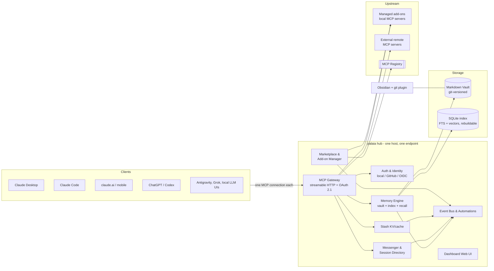

# palaia v3 — Masterplan

> **Living document.** This is the source of truth for palaia v3 scope, architecture,
> and roadmap. Scope changes go through PRs that update this file. Decisions are
> recorded in [`decisions/`](decisions/), supporting research in [`research/`](research/).
>
> Version 0.1 — 2026-08-22 — owner: cwendler (byte5)

---

## 0. TL;DR

**palaia v3 is Home Assistant for AI.** A self-hosted, open-source hub that gives all
of a user's AI systems — Claude, ChatGPT/Codex, Antigravity, Grok, local LLMs — one
shared memory, one central toolbox, and one way to talk to each other.

Install it once on any Linux box (or laptop) the way you'd install Home Assistant:
one command, then everything happens in a friendly web UI. Every AI client connects to
**one endpoint** instead of being configured tool-by-tool. What one agent learns, every
agent knows. Tools are installed once, in palaia, and appear everywhere.

v3 is a ground-up rewrite. v2 (a memory system primarily for OpenClaw) remains
available and hotfix-able on the `v2-maintenance` branch; its best concepts live on
in v3 (see [research/palaia2-feature-inventory.md](research/palaia2-feature-inventory.md)).

## 1. The Problem

AI power users today run **N clients × M tools**, and every cell of that matrix is
manual work:

- **Configuration sprawl.** Every MCP server must be configured in every client —
  Claude Desktop, Claude Code, ChatGPT, Codex, each IDE — with its own JSON/TOML
  syntax, its own credentials, its own update cycle.
- **Memory silos.** Each provider remembers (at best) its own conversations. Nothing
  learned in Claude reaches Codex. Nothing survives a provider switch. The user's
  accumulated context is scattered and mostly lost.
- **Blind, mute agents.** Concurrent agent sessions don't know each other. They
  duplicate work, collide on files, and cannot hand anything off — across providers
  there is no channel at all.
- **Expert-only self-hosting.** Existing building blocks (memory servers, MCP
  gateways, agent platforms) assume a terminal-native user. Nothing in this space has
  had its "Home Assistant moment": the appliance that made a hard domain accessible.

palaia v3 collapses N×M to **N+M**: each client connects once to palaia; each tool is
installed once in palaia. The hub does the rest.

## 2. Target Users

| Persona | Situation | What palaia gives them |
|---|---|---|
| **The multi-AI power user** (primary) | Uses Claude Code *and* Codex *and* a desktop chat app daily; pays for 2–3 subscriptions | One memory across all of them, tools configured once, phone access to the same brain |
| **The self-hoster / homelab user** | Runs Home Assistant, Umbrel or a NAS; comfortable installing apps, allergic to config files | An appliance-grade install, a beautiful dashboard, everything manageable in the browser |
| **The AI-heavy small team** (secondary) | 2–10 people, shared projects, agents working in repos | Shared team memory with scopes, an agent directory, observable agent-to-agent handoffs |
| **The tinkerer / developer** (ecosystem) | Builds MCP tools and skills | An add-on SDK and a store that puts their tool in front of users with one click |

Explicit **non-goals**: palaia is not a chat UI, not an LLM host (it doesn't run
models), not an agent framework (it doesn't orchestrate reasoning), not a vector-DB
product, and not a cloud service (local-first; optional relay is a later, separate
decision).

## 3. Product Pillars

### P1 — Memory (the core)
A shared, human-readable, git-versioned knowledge vault, served to every client via
MCP. The best concepts of palaia v2 (hybrid search, scopes, decay-ranked recall,
auto-capture, dedup, doctor) merged with the best of basic-memory (Markdown-first
knowledge graph, Obsidian compatibility, files as source of truth) — reimplemented
clean-room (see [ADR-002](decisions/002-clean-room-licensing.md)).

### P2 — Gateway ("configure once, use everywhere")
One MCP endpoint that aggregates everything behind it: palaia's built-in tools,
installed add-ons, and external MCP servers the user connects. Central auth, central
credential storage, per-client tool profiles. palaia sits as the layer between MCP
servers and AI clients — the multiple-setup problem disappears.

### P3 — Marketplace (the app store)
Browse, install, update and configure MCP tools and agent skills from the dashboard —
one click, no shell. Sources: the official MCP registry, a curated palaia add-on
store, and manual custom entries. Like Home Assistant's add-on store, this is what
turns a tool into a platform.

### P4 — Agent Directory & Messenger
Sessions become visible: what each agent is working on, where it runs, which model,
how long idle. On top of that, a cross-host, cross-provider messenger with
*structured* messages — designed so agents actually use it, and don't waste tokens
chatting (see §5.4).

### P5 — Stash
Cross-session cache for structured data (an existing in-house tool, integrated as a
built-in): intermediate results, handoff payloads, expensive computations — with TTL
and size discipline, separate from long-term memory.

### P6 — Automations & Hooks
An event bus over everything (memory written, message received, session idle, add-on
updated…) with user-defined reactions — webhooks, notifications, tool runs, memory
writes. Home Assistant's automation model, applied to AI infrastructure. This is a
gap in every comparable tool (basic-memory has no hooks at all).

### P7 — Dashboard
The face of the product and the primary interface: onboarding wizard, memory explorer
with graph view, "connect a client" flows, marketplace, session/message observability,
automations editor, health (doctor) and one-click updates. Beautiful, calm, legible.

## 4. UX Doctrine

These rules bind every feature. They are the product's identity; PRs that violate
them are rejected.

1. **The browser is the interface; the shell is the escape hatch.** Anything a user
   must do is possible in the dashboard. CLI exists for admins and automation, never
   as the only path.
2. **Onboarding is "paste one thing".** Connecting a client means pasting one URL
   (or clicking one bundle/deep link) — or, for agentic clients, pasting one prompt
   and letting the agent set itself up (the proven palaia v2 pattern; see
   palaia.byte5.ai). Target: **client connected in under 2 minutes.**
3. **Host install is one step.** One command (or one app-store click on
   Umbrel/CasaOS/NAS) brings up the hub; everything after that happens in the
   browser at `http://palaia.local`. Target: **first memory written within 5 minutes
   of install.** Never OpenClaw-grade setup pain.
4. **Defaults over decisions.** Zero mandatory configuration. Local embeddings,
   sensible scopes, auto-started services, auto-updates (opt-out, not opt-in).
   Every automatic thing is automatic.
5. **Self-healing over error messages.** The doctor concept from v2, elevated:
   continuous health checks surfaced in the dashboard with one-click (or automatic)
   fixes. An error the user must google is a bug.
6. **Beauty is a feature.** The eye eats first: a real design system, dark/light
   themes, live previews, empty states that teach. If it looks like an admin panel
   from 2015, it's not done.
7. **Trust through transparency.** Every automatic action (auto-capture, auto-update,
   agent message) is visible and reversible. Show what the AIs are doing.

## 5. System Architecture (draft)

> Draft level: enough to plan phases and pick a stack. Each component gets its own
> design doc + ADRs before implementation.

### 5.1 Memory engine

- **Vault:** a folder tree of Markdown files with YAML frontmatter — Obsidian-opens-it
  compatible by construction. Wiki-links (`[[...]]`) and lightweight semantic markup
  encode a knowledge graph *in* the documents: one entity per file, observations as
  categorized list items, typed relations via `[[wikilinks]]` with forward references
  (linking to entities that don't exist yet). Every note, observation and relation is
  addressable (`memory://` URLs). The basic-memory concept, reimplemented clean-room —
  and unlike basic-memory, **formally specified and versioned** from day one
  (see [research/basic-memory.md](research/basic-memory.md) and a dedicated ADR).
- **Optional structure:** per-type schemas stored as ordinary notes, validating in
  warn-first mode, with schema *inference* from actual usage — structure emerges,
  it is not imposed.
- **Files are the source of truth.** The database is a derived index (SQLite:
  full-text + vector search) that can be dropped and rebuilt from the vault at any
  time. Writes go through to disk **synchronously** (no accepted-but-not-yet-on-disk
  states). This inverts palaia v2's architecture and deletes its hardest parts (custom
  WAL, lock files) — crash safety comes from git + atomic writes + a disposable index.
- **Git-versioned:** the hub auto-commits with meaningful messages (which agent,
  which client, why). The user can inspect and edit the vault in Obsidian with the
  git plugin at any time; external edits are watched and re-indexed live.
- **Recall:** hybrid search (keyword + local embeddings by default), decay-scored
  ranking (v2's proven concept, minus physical file moves), token-budget-aware
  context assembly, scope filters — plus **graph traversal**: "continue where we left
  off" resolves a `memory://` reference and walks its relations with depth and
  timeframe limits, instead of re-searching.
- **Scopes & attribution:** every entry carries origin (provider, client, session,
  or human) and scope (private / project / shared). Scopes are enforced by the hub —
  clients only ever see what their token allows.
- **Auto-capture:** provider-appropriate mechanisms (skills, hooks, wrapper prompts)
  let agents save significant knowledge without being told; significance scoring and
  dedup keep the vault clean. Captured material enters through a **promotion ladder**
  (raw → candidate → accepted): agents propose memory, they don't silently create
  it. Always visible, always reversible (git).
- **Tool ergonomics:** every MCP tool ships behavior annotations
  (read-only/destructive hints), absorbs common LLM parameter-name misses via
  aliases, and the server serves a model-facing usage guide as an MCP resource —
  the difference between tools agents *have* and tools agents *use*.

### 5.2 Gateway

- **One endpoint, many tools:** built-ins (memory, stash, messenger) plus everything
  the user adds. Namespaced tool names; conflicts resolved by the hub.
- **Per-client tool profiles:** a hundred tools in every context window is how you
  ruin an agent. Each connected client gets a profile (default: sensible core set)
  that the user edits in the dashboard — e.g. "Codex gets memory only; Claude Desktop
  gets everything."
- **Central credentials:** upstream servers' API keys and OAuth grants live in
  palaia's encrypted secret store — entered once in the dashboard, never again in a
  client config file.
- **Capability adaptation:** clients differ in MCP feature support; the gateway
  degrades gracefully per client (this is also where new spec features get adopted
  once, for all tools).

### 5.3 Marketplace & add-ons

- **Three install sources:** (1) the official MCP registry, browsable in the
  dashboard with one-click connect; (2) the palaia add-on store — curated,
  containerized local MCP servers with a declarative manifest (config schema →
  auto-generated settings UI, permission declarations, health checks, update
  channel); (3) manual entries for anything else.
- **Skills, too:** the store distributes agent skills (SKILL.md packages) alongside
  tools, offered to clients that support them.
- **Security model:** add-ons declare permissions (network, filesystem mounts,
  memory-scope access); containers are sandboxed; the curated index is signed.
  A tool the user installs can be trusted *because* palaia constrains it.
- **Ecosystem play:** an add-on SDK + submission flow so third parties can list
  their tools — palaia becomes distribution for the MCP ecosystem, like HACS/add-on
  store is for Home Assistant.

### 5.4 Messenger & session directory

Why agents don't message each other today: they can't *discover* peers (session
lists carry no context), can't *address* them meaningfully, have no *protocol* (so
they'd chat expensively in prose), and no *habit* (nothing prompts them). v3 fixes
all four:

- **Directory:** sessions register (via skill/hook/SDK) with scope ("refactoring the
  billing service in repo X"), host, platform, agent kind, model, status and idle
  time, capabilities. Heartbeats with TTL; stale sessions age out visibly.
- **Addressing:** stable session handles plus role/scope queries ("who is working on
  repo X?").
- **Structured envelopes, not chat:** messages are typed
  (`request | inform | question | handoff | broadcast`) with subject, urgency,
  expected-reply flag, and a short body plus **references into the vault** — long
  content is written to memory once and pointed at, not re-serialized into every
  message. Token discipline by design.
- **Delivery:** pull (MCP tool) as the universal baseline; push adapters
  (webhooks/wake mechanisms) where platforms allow. Cross-host and cross-provider by
  construction — the hub is the broker.
- **Observability:** the dashboard shows the directory and message flows live; the
  human can read along, join in, or shut a conversation down. Trust rule #7.

### 5.5 Auth & network posture

- palaia implements the MCP authorization spec (OAuth 2.1: resource server metadata,
  dynamic client registration) so that claude.ai, ChatGPT and mobile apps can connect
  as remote connectors with a standard flow.
- **Identity:** local account created in the first-run wizard; GitHub / Google /
  generic OIDC as optional sign-in providers (the mcp-hub prototype's experience
  informs this layer).
- **Tokens per client** with scopes (toolset + memory scopes); a revocation UI.
- **Posture:** LAN-only by default. "Expose to the internet" is an explicit wizard
  with hardening checks; the recommended remote path is a tunnel add-on
  (Tailscale / cloudflared) rather than an open port. A hosted relay ("palaia
  cloud") is deliberately out of scope for now — open decision #8.

### 5.6 Events, hooks, automations

- Internal event bus with a stable public schema: `memory.entry.created`,
  `memory.entry.updated`, `message.received`, `session.registered`, `session.idle`,
  `addon.update_available`, `client.connected`, …
- Hooks subscribe actions to events: outbound webhook, notification, tool
  invocation, memory write, templated message.
- The dashboard gets an automation editor (trigger → condition → action) in a later
  phase; hooks-as-config ship first.
- Every palaia subsystem emits events — hooks are a platform property, not a
  memory feature (this is a headline differentiator vs. basic-memory).

## 6. Client Integration Matrix

> To be verified against [research/mcp-landscape-2026.md](research/mcp-landscape-2026.md)
> (in progress); mechanisms below reflect the state known as of writing.

| Client | Connection | Onboarding UX (dashboard "Connect a client" page) |
|---|---|---|
| Claude Desktop | Remote/local MCP; MCPB bundle | One-click MCPB download (double-click installs, config UI in Claude) or copy-paste connector URL |
| Claude Code | `claude mcp add --transport http …` | Copy button for the one-liner **or** paste-prompt: the agent runs setup itself (v2 pattern) |
| claude.ai web + mobile | Custom connector (remote MCP, OAuth) | Guided flow: expose/tunnel check → copy URL → OAuth dance handled by palaia |
| ChatGPT | Connectors / developer mode (remote MCP, OAuth) | Same guided flow, ChatGPT-specific steps |
| Codex (CLI/IDE) | `config.toml` MCP entry | Copy-paste snippet or paste-prompt for the agent |
| Antigravity | MCP config | Copy-paste snippet |
| Grok | MCP support where available | Snippet; degrade gracefully (verify current support) |
| OpenClaw | v2 plugin keeps working against v2; v3 adapter later | Not a v3 launch target — v2 serves it |
| Local LLM frontends (LM Studio etc.) | MCP where supported | Snippet |

Per-client quirks (auth requirements, plan gating, feature support) are tracked in
the research dossier and baked into the connect flows — the *user* never needs to
know them.

## 7. Heritage: what v3 takes from where

| Source | License | What v3 takes | How |
|---|---|---|---|
| palaia v2 | MIT (ours) | Hybrid search, scopes, decay ranking, auto-capture/significance, dedup, doctor, paste-prompt onboarding, projects | Concepts freely; code only where it genuinely fits the new architecture (mostly it won't — see inventory) |
| basic-memory | AGPL-3.0 | Markdown knowledge graph (entities/observations/relations), files-as-truth + rebuildable index, `memory://` addressing + graph-traversal recall, schema-as-notes, capture promotion ladder, MCP tool ergonomics, Obsidian compatibility | **Concepts only, clean-room; zero code, no runtime dependency** ([ADR-002](decisions/002-clean-room-licensing.md)). v3 additionally fixes its confirmed gaps: no events/hooks, no permissions, no git, no agent awareness. Plus: a vault *importer* |
| mcp-hub (private prototype) | ours | Auth/wrapper experience for exposing memory over MCP remotely | Direct reuse of learnings; repo access for research pending |
| Home Assistant | Apache-2.0 | The *model*: appliance install, add-on store, automations, `*.local` onboarding, community ecosystem | Inspiration & benchmarks, no code |

## 8. Stack — options and recommendation (decision pending)

**Recommendation: Python core + TypeScript dashboard, Docker-first.**

- **Hub/core: Python 3.12+** with FastMCP (server framework; composition/proxying
  and auth support align exactly with the gateway design — version per research
  dossier) and FastAPI for the dashboard/REST API. Rationale: the MCP server
  ecosystem's center of gravity is Python; local-embedding libraries are Python;
  the team's v2 experience is Python; basic-memory-parity features are naturally
  expressed in it.
- **Dashboard: TypeScript + React + Tailwind**, built to static assets and served
  by the hub — one process, one container. (Team has TS experience from the v2
  OpenClaw plugin.)
- **Storage: SQLite** (FTS5 + vector extension) as the only database — an index,
  not a source of truth. No Postgres in v3 core.
- **Packaging: single OCI container** for the MVP (`docker run … palaia`), compose
  file, one-line installer; add-on containers arrive with the marketplace phase;
  appliance/app-store images at launch.

Considered alternatives:

- **Rust or Go single-binary core** — best raw install story and performance, but
  slower to build, thinner MCP/embedding ecosystems, and it would forfeit the
  Python velocity this scope needs. Escape hatch: hot paths can move into a native
  extension later; the architecture keeps that door open.
- **TypeScript everywhere** — one language incl. dashboard, but the Python gravity
  of the MCP/embeddings world and the v2 codebase experience outweigh it.

## 9. Deployment & Distribution

1. **MVP:** `docker run` one-liner + compose file; mDNS so the dashboard is at
   `http://palaia.local`; first-run wizard does the rest. GHCR images, `stable` and
   `beta` channels, one-click self-update from the dashboard.
2. **Launch:** listings in self-hosting app stores — Umbrel, CasaOS, Runtipi,
   TrueNAS SCALE apps (submission mechanics in the research dossier) — plus a
   Home-Assistant add-on variant is worth evaluating (HA users are exactly the
   audience).
3. **Onboarding site:** a v3 successor to palaia.byte5.ai — pick your platform,
   paste one thing, under N minutes. Same pattern, bigger promise.
4. **Not the path:** OpenClaw-style multi-step terminal installs. If a step can't be
   automated, the wizard does it interactively in the browser.

## 10. Security & Privacy Principles

- Local-first: no data leaves the host unless the user connects something that
  reads it. No telemetry without explicit opt-in.
- Secure defaults: LAN-only, auth on from day one, encrypted secret store,
  least-privilege tokens per client, signed add-on index, sandboxed add-ons.
- Exposure is a ceremony: the "make public" wizard runs hardening checks
  (TLS, rate limits, fail2ban-class protections) and prefers tunnels.
- A security review gate before 3.0 (external eyes on the auth + gateway surface).

## 11. Migration

- **From palaia v2:** importer reads a v2 store (SQLite + tier directories) and
  writes vault entries with preserved metadata (types, scopes, tags, timestamps).
- **From basic-memory:** vault-to-vault importer (their format is Markdown too;
  reading a user's own files has no license implications).
- **From nothing:** the wizard offers to start with a template vault that teaches
  the format by example.

## 12. Roadmap

Phases have exit criteria, not dates. Each phase ends with something a real user can
use. Detailed specs + ADRs are written per phase, not upfront.

| Phase | Theme | Ships | Exit criterion |
|---|---|---|---|
| **0** | Foundation | Masterplan sign-off; stack + license decided (ADRs); UX north-star mockups; v3 scaffolding + CI lane; two spikes: (a) FastMCP gateway aggregating 2 servers behind one authed endpoint, (b) vault+index engine round-trip | Spikes prove the two riskiest assumptions |
| **1** | Memory core (MVP) | Hub daemon; vault engine (git, watch, reindex); recall/search; MCP endpoint (HTTP, token auth); dashboard v0 (wizard, explorer, connect page); Claude Desktop + Claude Code + Codex connected; v2 + basic-memory importers; doctor v0 | **Two different providers share one memory on day one**, installed without shell beyond one docker command |
| **2** | Remote & identity | OAuth 2.1 server (DCR, resource metadata); GitHub/Google/OIDC sign-in; claude.ai + ChatGPT + mobile connectors; exposure wizard + tunnel add-ons; stash; event bus + hooks v1; auto-capture skills | **Phone Claude remembers what desktop Codex learned** |
| **3** | The hub | Gateway aggregation (external servers + registry browse); per-client tool profiles; marketplace v1 (curated index, one-click install, config UIs); MCPB/one-click client bundles; automations editor | **Install a tool once, every AI has it** |
| **4** | The team | Session directory + messenger; structured-messaging skills; message observability; add-on SDK + community submissions | **Two agents on different providers hand off work through palaia** |
| **5** | 3.0 launch | App-store/appliance distribution; hardening + external security review; docs site + onboarding page; v2 sunset messaging | **A non-developer completes install → first shared memory unaided** |

## 13. Success Metrics

- Time-to-first-memory (install → first entry): **< 5 min**, measured in onboarding.
- Client connect time: **< 2 min** per client.
- Wizard completion rate; % of installs with ≥ 2 providers connected within a week.
- Weekly recall hits per active install (is the memory *used*?).
- Marketplace: add-ons installed per install; third-party add-ons listed.
- Messenger: % of multi-session users with ≥ 1 structured handoff per week.

## 14. Risks & Mitigations

| Risk | Mitigation |
|---|---|
| MCP spec churn (fast-moving standard) | Isolate protocol behind the gateway; track spec via conformance tests; FastMCP absorbs much of it |
| Client policy shifts (connector rules, plan gating by Anthropic/OpenAI) | Multiple integration paths per client; research dossier kept current; never depend on one client's policy |
| Public endpoint security | Secure-by-default posture (§10), tunnel-first remote story, external review before 3.0 |
| Scope creep (this plan is big) | Phase exit criteria are binding; MVP = memory; everything else stacks on top |
| AGPL contamination from basic-memory | ADR-002 hard rule; contributor guidance; importer instead of dependency |
| Tool-context bloat (agents drowning in tools) | Per-client profiles by default; curated core set; measure tool-call success |
| Solo-maintainer bus factor | ADRs + this plan keep context transferable; agent-friendly repo conventions |
| v2 users stranded | v2 stays installable + hotfix-able (`v2-maintenance`); importer + migration guide in MVP |

## 15. Open Decisions

| # | Decision | Recommendation | Status |
|---|---|---|---|
| 1 | Stack | Python core + FastMCP, TS/React dashboard, Docker-first (§8) | **Owner call** after reading §8 |
| 2 | License for v3 | Apache-2.0 (patent grant, HA precedent); MIT acceptable | **Owner call** ([ADR-002](decisions/002-clean-room-licensing.md) pending on this) |
| 3 | Name & versioning | Keep "palaia", version 3.0; product surface named "palaia hub" | Proposed |
| 4 | Add-on runtime | Phase 1–2: built-ins + external servers only; container add-ons in phase 3 (needs docker-socket ADR) | Proposed |
| 5 | Memory entry taxonomy | Workshop during phase 0 (types, frontmatter schema, graph markup) | Open |
| 6 | Messenger placement | Built-in pillar, not an add-on | Proposed |
| 7 | Building in the open | This plan is public in a public repo — accepted implication of in-repo planning | Confirm |
| 8 | Hosted relay ("palaia cloud") | Defer; design tunnel-first, keep relay possible later | Proposed |
| 9 | mcp-hub research access | Mirror `iret77/mcp-hub` into `byte5ai` org so this environment can read it | **Owner action** |
| 10 | v2 stale-branch cleanup (113 merged branches) | Delete merged branches; tags preserve history | **Owner call** |

## 16. Document Map

- `v3/MASTERPLAN.md` — this file
- `v3/research/palaia2-feature-inventory.md` — v2 capability baseline with verdicts
- `v3/research/basic-memory.md` — concept dossier (what to adopt/avoid)
- `v3/research/mcp-landscape-2026.md` — protocol/client/ecosystem facts, dated + sourced
- `v3/decisions/` — ADRs (001 two-track repo, 002 clean-room licensing, …)

Next planning artifacts (phase 0): UX north-star mockups, memory format ADR, gateway
spike report, stack + license ADRs.
