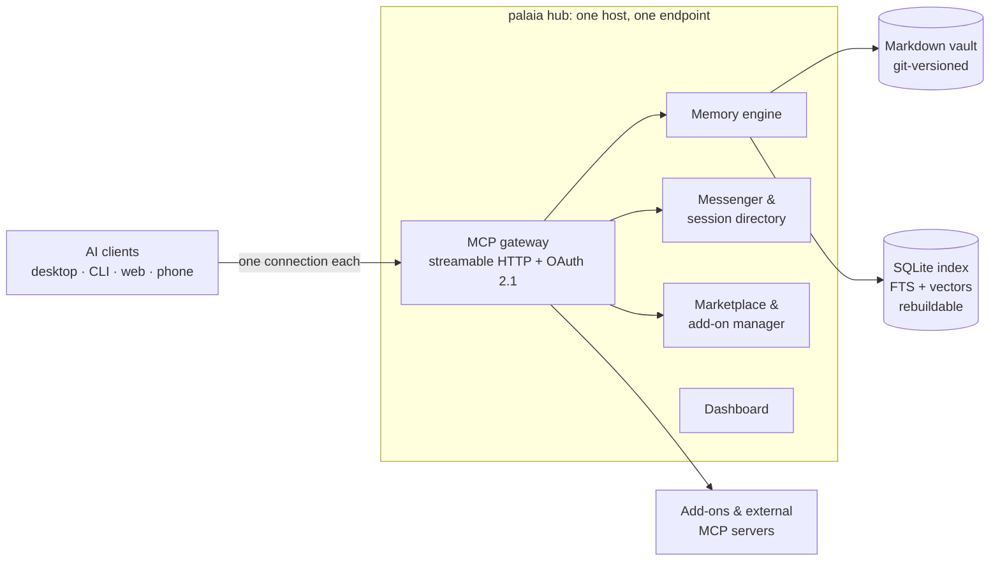

# How palaia works

The technical overview behind the [README](../../README.md): what is in the box,
how it is put together, and the evidence behind the claims. If you just want to
run palaia, the README's Quickstart is enough; this page is for people who want
to understand it before they trust it.

## What you get, in detail

Grouped by what it does for you, not by what module it lives in. Every item below
ships in `3.0.0-rc1`; the full list is in [`CHANGELOG.md`](../CHANGELOG.md).

### Memory that outlives the session

- **A vault of plain Markdown files you own.** One note per thing, YAML frontmatter,
  wikilinks and backlinks. Obsidian opens it as-is. The format is
  [formally specified](vault-format.md) and pinned by a conformance suite.
- **Every change is a real git commit**, written by the hub with a meaningful message
  (which agent, which client, why). `git log` is your audit trail; `git revert` is
  your undo.
- **Search that finds meaning, not just strings.** Full-text and hybrid text+vector
  recall, graph traversal ("continue where we left off"), and context assembly that
  respects a token budget. Embeddings are optional and local; without them, search
  falls back to text-only instead of breaking.
- **An inbox and a curator.** Agents drop what they learn mid-work without deciding
  where it belongs; an asynchronous curator files, merges and de-duplicates it.
  Adding knowledge is autonomous; rewriting or retiring existing notes only ever
  becomes a proposal you approve.
- **Skills that teach your tools to save and look things up on their own**, so you
  stop having to ask every time.

### Connect every AI tool, once

- **One MCP endpoint** for Claude Code, Claude Desktop, claude.ai, ChatGPT, Codex,
  Gemini/Antigravity CLI, Grok, LM Studio, and anything else that speaks MCP. Each
  has its [own connect guide](../site/docs/src/content/docs/connect/clients/).
- **A one-click desktop bundle (MCPB).** Download, click, connected. No address to
  type, no token to paste.
- **Real auth, not a shared secret.** Sign in with GitHub, Google or any OIDC
  provider, plus a full OAuth 2.1 authorization server (dynamic client registration,
  PKCE, token rotation), plus per-client tokens for tools that don't do OAuth.
- **Per-client tool profiles.** Give your phone's assistant a narrow tool set and
  your desktop everything, from one place, with zero client-side config. Each profile
  is its own endpoint URL.
- **Three access modes (Locked, Cloud, Open)**, chosen in a wizard and enforced in
  code, so how far your memory reaches is a decision you made
  ([modes explained](exposure.md)).

### A marketplace, and automations

- **Install a tool once; every connected AI has it.** A curated add-on index and a
  one-click marketplace in the dashboard, plus support for any
  [external MCP server](external-servers.md) with its credentials in an encrypted
  store: entered once, never again in a client config file.
- **An event bus with a rules editor.** A new note, a recall, a message, an idle
  session: hook any of it to webhooks, notifications, tool runs or memory writes
  ([events](events.md)).
- **An SDK for add-on authors**, with local testing and a submission flow
  ([`sdk/`](../sdk/README.md)).

### Agents that can find and hand off to each other

- **A session directory.** One AI session can discover another already working on
  something related, by what it's doing, never by a hardcoded name.
- **Structured messages between sessions**, including a `handoff` type that carries a
  reference *into memory* instead of duplicating the text ([messenger](messenger.md)).
- **Skills that make tools check their inbox and hand off work unprompted**, plus a
  team screen showing who is doing what.

### Operations you can live with

- **A real dashboard.** Setup wizard, memory explorer, per-client connect pages,
  marketplace, profile editor, health. Three in-chat MCP Apps (hub status, recall
  explorer, review queue) cover the everyday checks without a browser tab.
- **One-click backup** of the entire hub home, and a documented offline restore
  ([backup & restore](backup-restore.md)).
- **Release channels** (`stable` / `beta` / `edge`) and an in-dashboard update check
  ([updates](../deploy/README.md#updates-spec-501)).
- **A hardened container.** Non-root, all capabilities dropped, read-only filesystem,
  `no-new-privileges`. The flags in the README's Quickstart are the real, tested
  configuration, the same ones the install script and compose file use.

## The two claims, and the evidence

Both of palaia's core claims are proven end to end by tests that run a real hub over
a real socket.

**1. Install a tool once; every AI already has it.** One marketplace install call,
two clients with completely different credentials, on two different profiles, zero
client-side configuration on either: both list the new tool and both can call it.
Evidence: [`test_spec308_phase3_gate.py`](../server/tests/e2e/test_spec308_phase3_gate.py),
written up in [client-matrix-results §7](client-matrix-results.md).

**2. What one tool learns, the next one already knows.** From an empty hub: the
wizard runs, a vault is created, a real client connects over OAuth and writes a
fact, and a second client on a different credential recalls that exact fact. Under
13 seconds, twice in a row, with no reconfiguration in between.
Evidence: [`test_spec506_phase5_gate.py`](../server/tests/e2e/test_spec506_phase5_gate.py),
written up in [client-matrix-results §9](client-matrix-results.md).

To be honest about the edges: those runs use a real client CLI and a real scripted
MCP client, not a phone and not a second vendor's binary. The hub's protocol surface
is not client-specific, but the phone-shaped and second-vendor-shaped versions of
these demos are owner tasks still open. Every such gap is listed, by name, in
[client-matrix-results](client-matrix-results.md) rather than glossed over.

## Architecture



The parts worth knowing before you read code:

- **One hub, one endpoint.** The gateway aggregates built-in tools, installed add-ons
  and external MCP servers behind a single streamable-HTTP endpoint per profile
  (`/mcp/<profile>`), so the URL a client connects to already selects its tool
  surface. Names are namespaced and user-renamable; an agent must be able to pick
  the right tool from the surface alone.
- **Files are the source of truth.** The vault is plain Markdown + YAML frontmatter
  in a git repository. Writes go to disk synchronously; there is no
  accepted-but-not-yet-persisted state. Crash safety comes from git and atomic
  writes, not from a custom WAL.
- **The database is derived, and disposable.** A per-vault SQLite index (full-text +
  `sqlite-vec` vectors) is rebuilt from the vault on every start. Delete it and
  nothing is lost. A known trade-off is documented rather than hidden: metadata
  filters on a vector query are applied after the KNN step, so a heavily filtered
  query over-fetches before filtering ([MASTERPLAN §5.1](../MASTERPLAN.md)).
- **Auth is real.** OAuth 2.1 with dynamic client registration and PKCE, IdP sign-in
  (GitHub / Google / OIDC), and per-client bearer tokens for clients that can't do
  OAuth. Scopes are enforced hub-side; a client only ever sees what its token allows.
- **Exposure is an explicit mode.** Locked / Cloud / Open change what is reachable and
  what sign-in is mandatory, enforced at config-load, wizard and request time
  ([exposure](exposure.md), [threat model](security/threat-model.md)).
- **Vaults are physically isolated.** One vault with scopes, or many fully separate
  ones (work / personal / a project): a search in one can never surface another's
  content.

Go deeper: [`MASTERPLAN.md`](../MASTERPLAN.md) is the source of truth for scope and
design; [`decisions/`](../decisions/) holds the ADRs; [`specs/`](../specs/) holds the
executable SPECs (one SPEC = one branch = one PR); [`README.md`](../README.md) has
the dev setup, test and lint commands.

## When to use it, and when not to

**Reach for palaia if** you use two or more AI tools and are tired of configuring the
same MCP server in each of them; if you want your AI's memory to be files you own on
hardware you control; if you self-host already and want an appliance rather than a
weekend project; or if you want agents on different machines and different providers
to be able to hand work to each other.

**Look elsewhere if** you use exactly one AI tool and its built-in memory is enough
(palaia's whole point is the second tool); if you want a hosted service with no
server to run, because palaia is self-hosted by design and there is no cloud version;
if you need a chat UI or an agent framework, because palaia hosts no models and
orchestrates no reasoning; or if you need a workflow from the
[v2 feature list](migrate-from-v2.md#what-v3-doesnt-have-yet) that v3 hasn't
carried over yet. That table is kept honest, so check it before you move.

## Day-2 operations

**Update.** The dashboard shows an "update available" banner and updates in one click.
On the command line it is pull-and-recreate:

<!-- rc-channel-note -->
> **Release candidate:** until `3.0.0` is final there is no `stable` image yet. Where a
> command or file on this page says `ghcr.io/byte5ai/palaia-hub:stable`, use
> `ghcr.io/byte5ai/palaia-hub:beta` for now.

```bash
docker pull ghcr.io/byte5ai/palaia-hub:stable
docker stop palaia-hub && docker rm palaia-hub
# re-run the same `docker run` command from the README's Quickstart
```

With Compose, `palaia-hub update --channel stable --file docker-compose.yml` rewrites
the pinned tag, then `docker compose pull && docker compose up -d`. Details and the
channel semantics: [`deploy/README.md`](../deploy/README.md#updates-spec-501).

**Back up first.** "Back up" in the dashboard streams a `tar.gz` of the whole hub
home: config, every vault including its git history, OAuth keys, the encrypted secret
store, tokens, hooks and automations. Or from the host:

```bash
docker run --rm -v palaia_home:/data -v "$(pwd)":/backup alpine \
  tar czf /backup/palaia-backup.tar.gz -C /data .
```

What is in the archive, what is deliberately left out, and how to restore offline:
[backup & restore](backup-restore.md).

**Coming from palaia v2?** One command imports your existing store into a v3 vault,
entry by entry, with provenance preserved. It only ever *reads* your v2 install, so
rolling back means deleting what it wrote. Read
[Moving from palaia v2 to v3](migrate-from-v2.md) first, especially the table of
what v3 does not carry yet.

**Something wrong?** [Troubleshooting](../site/docs/src/content/docs/troubleshooting.md)
covers the common ones; otherwise [open an issue](https://github.com/byte5ai/palaia/issues).

## palaia v2 (maintenance mode)

palaia v2, the Python package at the repository root (a memory system built primarily
for OpenClaw), is stable, still installable, and still supported. It is in
maintenance mode: no new features, but critical hotfixes (security, data loss, a broken
release) land on the
[`v2-maintenance`](https://github.com/byte5ai/palaia/tree/v2-maintenance) branch, and
`v2.x.y` tags are cut from there.

```bash
pip install "palaia[mcp,fastembed]"
palaia init
```

Its documentation is unchanged and still current:
[Getting started](../../docs/getting-started.md) ·
[CLI reference](../../docs/cli-reference.md) ·
[Configuration](../../docs/configuration.md) ·
[MCP server](../../docs/mcp.md) ·
[Multi-agent](../../docs/multi-agent.md) ·
[Architecture](../../ARCHITECTURE.md) ·
[Changelog](../../CHANGELOG.md) ·
[PyPI](https://pypi.org/project/palaia/)

Nobody is being pushed off it. When you are ready, the
[migration guide](migrate-from-v2.md) covers what carries over, what changes, what
is missing, and how to roll back.
